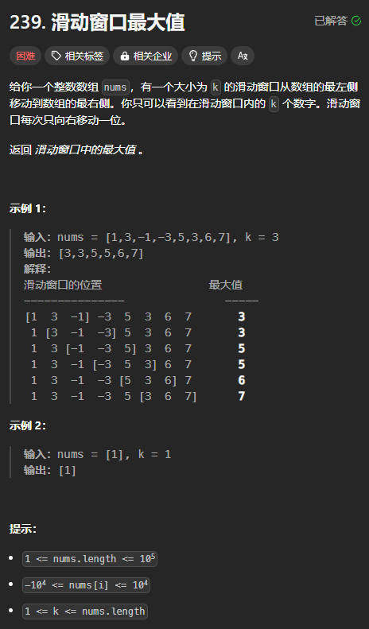
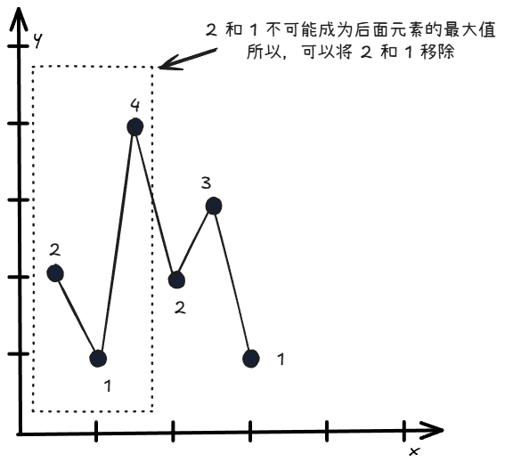
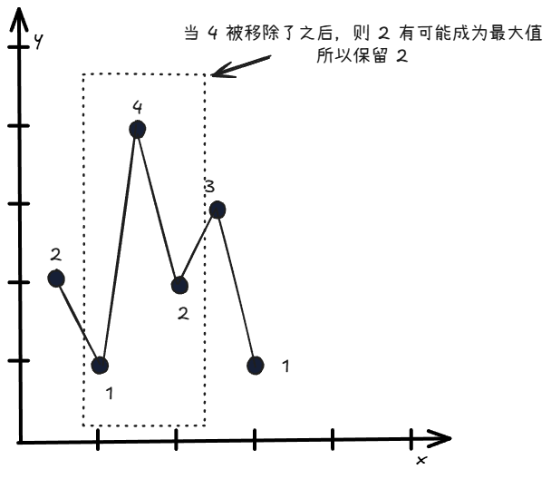

单调队列 = 单调栈 + 滑动窗口

如果将滑动窗口的窗口大小固定为无穷大，那么单调队列就是单调栈。

如果滑动窗口的大小较小，则由于要弹出对首的元素，所以要用队列来存储数据。

## 例题：滑动窗口最大值
题目链接：[https://leetcode.cn/problems/sliding-window-maximum/description/](https://leetcode.cn/problems/sliding-window-maximum/description/)



### 思路
当 k = 3 时：

 

所以，当遍历到一个元素比滑动窗口队尾元素还要大的时候，就说明队尾元素不可能成为最大值，所以将该队尾元素移除，然后将遍历到的元素加入到队尾（这类似与单调栈）。

由于滑动窗口的窗口大小是固定的，所以当最大值被移除了之后，原来比最大值小的元素是有可能成为最大值的，所以，如果当前遍历到一个元素比队尾元素小（也同时意味着比最大值小），则还是将其加入到单调队列中。

### 代码
```rust
use std::collections::VecDeque;

impl Solution {
    pub fn max_sliding_window(nums: Vec<i32>, k: i32) -> Vec<i32> {
        let n = nums.len();
        let k = k as usize;
        
        // 队列的第一个元素就是窗口的最大值
        let mut q = VecDeque::new();
        let mut ans = vec![];

        for (i, &num) in nums.iter().enumerate() {
            while !q.is_empty() && nums[*q.back().unwrap()] <= num {
                q.pop_back().unwrap();
            }
            q.push_back(i);

            // i - (k - 1) 是滑动窗口内最左边的一个元素，而 i 就是滑动窗口内最右边的元素
            // 所以要保证 q.front() < i - (k - 1) 的时候被弹出
            // 需要特别注意的是，当 i 很小的时候，会造成减去之后是负数，所以要变换一下使其不会溢出
            if k - 1 < i - *q.front().unwrap() {
                q.pop_front().unwrap();
            }

            if i >= k - 1 {
                // 此时，窗口刚好完全“展开”
                ans.push(nums[*q.front().unwrap()]);
            }
        }

        ans
    }
}
```

