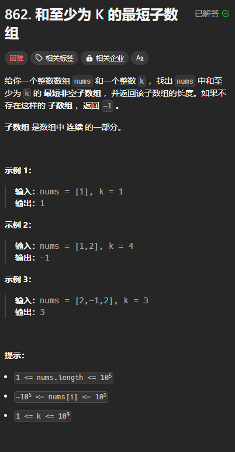
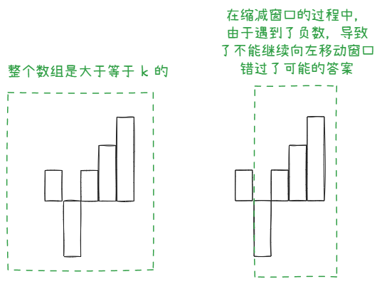
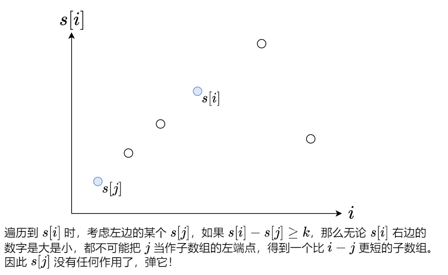
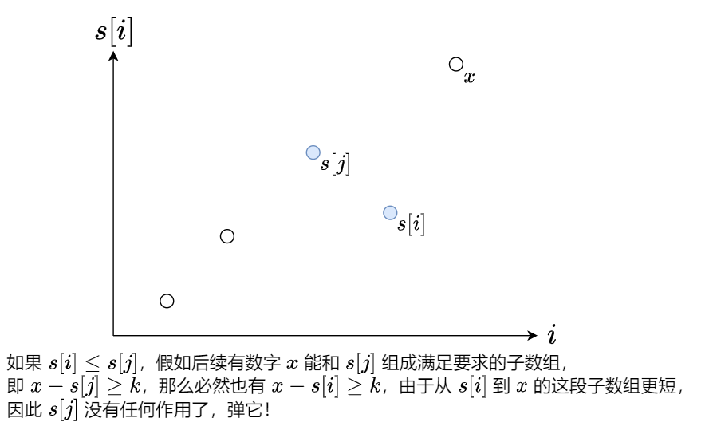

题目链接：[https://leetcode.cn/problems/shortest-subarray-with-sum-at-least-k/description/](https://leetcode.cn/problems/shortest-subarray-with-sum-at-least-k/description/)



## 思路
简单一看，这是一个简单的不定长的滑动窗口，只需要记录窗口内的和就可以了。

但是对于测试用例 `[1, -2, 1, 2, 3] k = 6` 的情况：



我们可以用**前缀和 pre_sum **来转换问题，有了前缀和之后，就相当于从前缀和中选两个端点（假设分别为 left 和 right，left <= right）组成一个区间，这个区间内的元素之和要满足 `pre_sum[right] - pre_sum[left] >= k`

 我们可以枚举 right（图中是 i）：





上述思路要有一个数据结构能够将所有遇到的元素都加入到其中，还要从左端和右端移除元素，所以使用双端队列。而第二张图片描述的思路会使双端队列表现为单调递增，所以，此数据结构也可以说成是单调队列。

## 代码
```rust
use std::collections::VecDeque;

impl Solution {
    pub fn shortest_subarray(nums: Vec<i32>, k: i32) -> i32 {
        let k = k as i64;
        let nums = nums.into_iter().map(|num| num as i64).collect::<Vec<_>>();
        let n = nums.len();
        
        let mut pre_sum = vec![0; n + 1];
        for i in 0..n {
            pre_sum[i + 1] = pre_sum[i] + nums[i];
        }

        let mut ans = i32::MAX;
        let mut q = VecDeque::new();
        for (right, &x) in pre_sum.iter().enumerate() {
            // 如果 pre_sum[right] - pre_sum[q[0]] 大于等于 k，则后面再没有
            // 任何元素能够比 [q[0], right] 的长度更小了，所以 q[0] 是没有用了
            while !q.is_empty() && x - pre_sum[q[0]] >= k {
                ans = ans.min((right - q[0]) as i32);
                q.pop_front().unwrap();
            }
            // 如果 pre_sum[q.back()] 大于等于 x，如果后面有一个元素 a 可以使得 a - pre_sum[q.back()] >= k，则
            // 必定也能使 a - x >= k，而 a 与 right 的距离要更近一点，所以，就没有必要再保存着 q.back() 了
            while !q.is_empty() && pre_sum[*q.back().unwrap()] >= x {
                q.pop_back().unwrap();
            }
            q.push_back(right);
        }

        if ans == i32::MAX { -1 } else { ans }
    }
}
```

## 总结
这题主要是运用了单调队列中的元素的先后顺序是和原数组中的先后顺序是一样的。

意识到上面这一点之后，再去考虑如何弹出和加入元素逻辑会清晰很多。

这题也体现了单调队列不仅仅只是求最大值或者最小值，还可以借助它的性质来解决很多问题。


