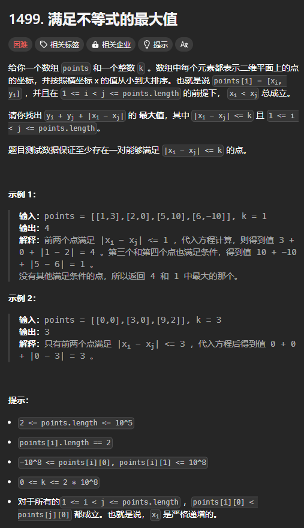

题目链接：[https://leetcode.cn/problems/max-value-of-equation/description/](https://leetcode.cn/problems/max-value-of-equation/description/)



## 思路
假设 `i < j`。

题目要求 `y[i] + y[j] + |x[i] - x[j]|` 的值，由于 `x[j] >= x[i]` 总是成立的，所以要求的东西可以变化为 `(y[i] - x[i]) + (y[j] + x[j])`，所以，只要是最大的 `y[j] + x[j]` 和 `y[i] - x[i]`加起来一定是最大的。

当我们枚举 j 的时候，`x[j] + y[j]` 是固定的，所以，只需要知道 `y[i] - x[i]` 的最大值就可以了。

## 代码
```rust
use std::collections::VecDeque;

impl Solution {
    pub fn find_max_value_of_equation(points: Vec<Vec<i32>>, k: i32) -> i32 {
        let mut q = VecDeque::<usize>::new();

        let mut ans = i32::MIN;
        let mut i = 0;
        for (j, point) in points.iter().enumerate() {
            let (xj, yj) = (point[0], point[1]);
            
            // 确保单调队列中的下标小于 j
            if j > 0 {
                let i = j - 1;
                let (xi, yi) = (points[i][0], points[i][1]);

                while !q.is_empty() && yi - xi >= points[*q.back().unwrap()][1] - points[*q.back().unwrap()][0] {
                    q.pop_back().unwrap();
                }
                q.push_back(i);
            }

            while points[i][0] < points[j][0] - k {
                i += 1;

                if !q.is_empty() && q[0] < i {
                    q.pop_front().unwrap();
                }
            }

            if !q.is_empty() {
                ans = ans.max(xj + yj + points[q[0]][1] - points[q[0]][0]);
            }
        }

        ans
    }
}
```


