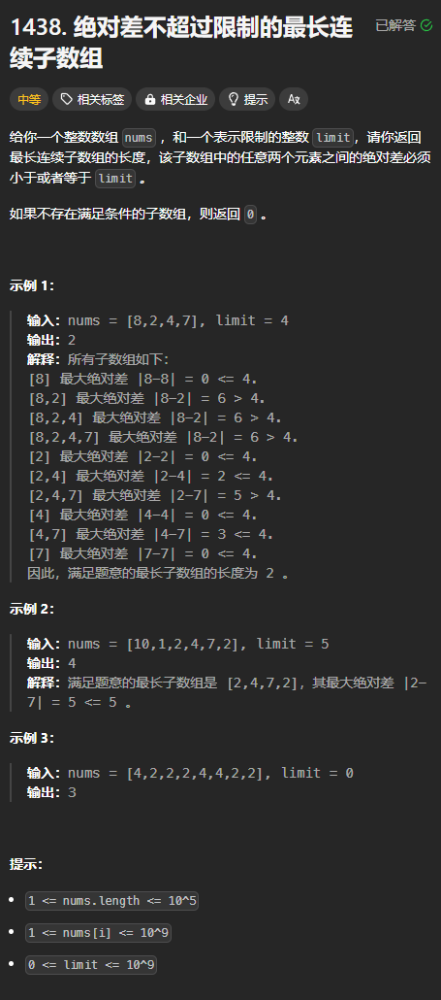
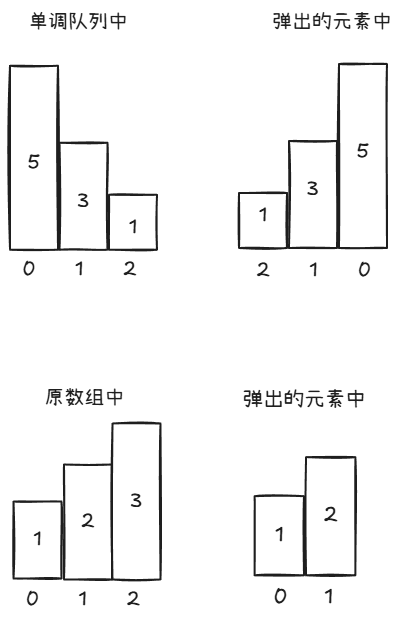
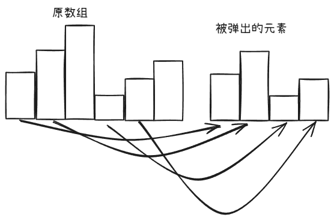

题目链接：[https://leetcode.cn/problems/longest-continuous-subarray-with-absolute-diff-less-than-or-equal-to-limit/description/](https://leetcode.cn/problems/longest-continuous-subarray-with-absolute-diff-less-than-or-equal-to-limit/description/)



## 思路
最大绝对差在子数组的最大值与最小值之间取到，所以，我们要维护子数组的最大与最小值。

所以，我们考虑使用单调队列来维护一个区间内元素的最大值。

需要注意的是：

+ 单调队列存储的只能是一个区间内的最大值和其它可能成为最大值的值
+ 单调队列不能同时存储最大值和最小值。这是因为如果要维护一个单调递减的单调队列来求最大值，则如果有一个元素比当前队尾元素值大，则会将队尾元素弹出，而该队尾元素就有可能是最小值

### 错误思路
但是，如果我们观察从单调递减的队列中被弹出的元素，会发现它们是有序的：



注意到：

+ 在弹出的元素中，元素总是递增的
+ 弹出的元素的下标没有固定的顺序

我们可以断言，如果有被弹出的元素，则最小值一定在被弹出的元素中。而被弹出的元素是递增的，所以，最小值就是被弹出元素的第一个。

> 因为在单调队列中的元素的最小值总是比被弹出的元素中的最大值大。
>
> 这又是为什么呢？
>
> 因为当单调队列中进入一个元素的时候，该元素总是以最小值的身份进入的，如果前面有比它小的元素，则就会被弹出。
>

如果没有被弹出的元素，则最小值就是单调队列的最后一个元素。

---

上面的思路之所以是错误的，是因为弹出的元素并不一定是有序的。例如：



可以看到，被弹出的元素的最小值不在第一个位置上。

### 正确思路
我们可以像维护最大值一样用一个单调递增的单调队列维护一个最小值。而不必追求不可能的完美。

## 代码
```rust
use std::collections::VecDeque;

impl Solution {
    pub fn longest_subarray(nums: Vec<i32>, limit: i32) -> i32 {
        // 单调递减
        let mut max_deque = VecDeque::new();
        // 单调递增
        let mut min_deque = VecDeque::new();

        let mut ans = 0;
        
        let mut left = 0;
        for (right, &num) in nums.iter().enumerate() {
            // 维护最大值
            while !max_deque.is_empty() && nums[*max_deque.back().unwrap()] < num {
                max_deque.pop_back().unwrap();
            }
            max_deque.push_back(right);
            // 维护最小值
            while !min_deque.is_empty() && nums[*min_deque.back().unwrap()] > num {
                min_deque.pop_back().unwrap();
            }
            min_deque.push_back(right);

            while nums[max_deque[0]] - nums[min_deque[0]] > limit {
                left += 1;

                if max_deque[0] < left {
                    max_deque.pop_front().unwrap();
                }
                if min_deque[0] < left {
                    min_deque.pop_front().unwrap();
                }
            }

            ans = ans.max(right - left + 1);
        }
        
        ans as _
    }
}
```

