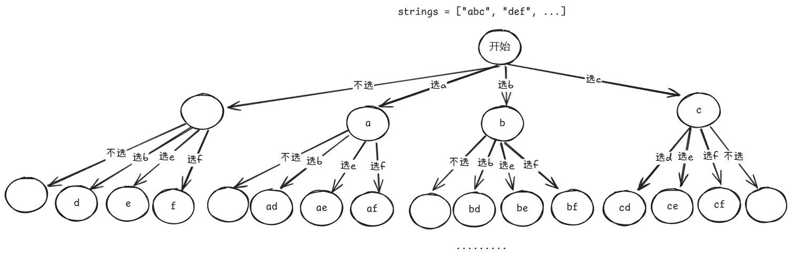

## 引例
假设有这么一个问题，给定一个长为 n 的字符串数组 strings，按顺序从每个字符串中选取任一一个字符，组成一个长为 n 的字符串。

如果 n 为 2 ，我们可以这么写：

```rust
for x in strings[0] {
    for y in strings[1] {
        ...
    }
}
```

但是，如果 n 很大，而且不确定的时候怎么办呢？

我们可以用递归来解决，让每次调用递归函数，相当于手写一次循环：

+ 我们使用一个参数 index 来表示当前进行遍历到的的字符串是哪一个
+ 用一个全局变量 path 表示前面被选择的字符

这样的话，我们让 index 从 0 开始，当 index 等于 n 的时候（递归的边界条件），我们就知道了所有的字符串都选择了一个字符。就将 path 加入到答案中。

伪代码如下：

```rust
fn dfs(index: usize, path: &mut Vec<char>) {
    if index == n {
        // 将 path 加入到 ans 中
        return;
    }

    // 从 strings[index] 中枚举一个字符
    for c in strings[index] {
        // 我们将 c 加入到 path 中
        path.push(c);
        // 然后选取下一个 string 的下一个字符
        dfs(index + 1, path);
        // 由于每一个 string 只能选取一个字符
        // 所以，进行下一次循环之前，要将原来加入的字符弹出来
        // 这被称为“恢复现场”
        path.pop();
    }
}
```

上述的递归思路就被称为回溯。

## 回溯与 DFS
回溯适用于能够将原问题拆分为子问题的问题。例如，上面的问题能够将构造长度为 n 的字符串拆分为构造长度为 n - 1 的字符串，再加上当前 string 的其中一个字符。

回溯中包含一个**增量（逐步）构造答案**的过程：


观察下图，增量构造答案的过程是通过 DFS 完成的：


所以，可以将控制递归的那一套理论用在回溯上面。

### 子集型回溯
假设引例中要求构造长度为 0~n 的所有可能的子字符串，而不是一定要从每个字符串中选出一个字符组成答案，那么 DFS 就会是这样：


其在上图中的体现就是每层都会有跳过本层的所有节点，而直接去选取下一层节点的操作。

对应的代码就是：

```rust
fn dfs(index: usize, path: &mut Vec<char>) {
    if index == n {
        // 将 path 加入到 ans 中
        return;
    }

    // 不选取本层的节点，直接跳过本层的节点
    // 因为没有选取本层的节点，所以归的时候不需要任何处理
    dfs(index + 1, path);
    
    // 从 strings[index] 中枚举一个字符
    for c in strings[index] {
        // 我们将 c 加入到 path 中
        path.push(c);
        // 然后选取下一个 string 的下一个字符
        dfs(index + 1, path);
        // 由于每一个 string 只能选取一个字符
        // 所以，进行下一次循环之前，要将原来加入的字符弹出来
        // 这被称为“恢复现场”
        path.pop();
    }
}
```

子集型回溯有 2 种思考的角度：

#### 输入的角度
对于输入的 index，我们可以选择让 index 对应的节点们**选或不选**。上述的代码就是输入角度的代码。



#### 答案的角度
枚举答案的第一个元素选谁、第二个元素选谁.......。这种角度每次从上一层“递”下来的时候，path 都是一个合法的答案。即下图中的每个节点的值都是一个答案：


答案角度有一个很好的性质：

+ **当 index = 1 的时候，就知道一定有 index = 0 的元素被选择了**

这个性质在下面这题被应用来去重：

[删除无效的括号](https://www.yuque.com/cline-mly1u/bgacuc/ql3xslk7aounmmzi)

答案角度的代码：

```rust
fn dfs(index: usize, path: &mut Vec<char>) {
    // 每次的“递”的过程都是一个答案
    // 将 path 加入到 ans 中
    ...

    // 不能将其移动到前面去，否则，会造成叶子节点部分的答案丢失
    if index == n {
        return;
    }
    // 枚举选择哪一个作为答案
    for c in strings[index] {
        // 将 c 作为答案的一个元素
        path.push(c);
        // 然后选取下一个 string 的下一个字符
        dfs(index + 1, path);
        // 由于每一个 string 只能选取一个字符
        // 所以，进行下一次循环之前，要将原来加入的字符弹出来
        // 这被称为“恢复现场”
        path.pop();
    }
}
```

### 组合型回溯
组合型回溯的问题一般都是从一个集合中选取 k 个元素，组合成一个子集。即我们要选取特定数量 k 个元素，然后将其加入到答案中。

组合型回溯可以用子集型回溯的思路来解决，因为选取的 k 个元素一定是原集合的子集。

组合型回溯可以从输入的角度来思考：

+ 可以选或不选本层的节点
+ 如果 path 的长度等于 k，则说明找到了一个答案

组合型回溯也可以从答案的角度来思考：

+ 只要“递”到本层的 path 的长度为 k，则说明这是一个合法的答案

#### 剪枝优化
如果未遍历过的集合元素的数量小于答案所需要的最少元素数量，则可以不继续递归：

例如，假设 m + n = k，当前已经将 m 个元素加入到 path 中，还差 n 个元素才能将 path 加入到 ans 中，但是，剩余的元素已经没有 n 个了，这意味着选取后面所有的元素也不可能构造出答案。那么，就没必要再递归去选取后面的元素了。

### 排列型回溯
排列问题一般是：给定一个集合，返回这个集合中的所有可能排列的情况。

排列与组合的一个重要区别是：

+ 组合中 [1, 2, 3] 和 [3, 2, 1] 被视为同一个答案，而在排列中，两者是不同的答案

排列问题一般从答案的角度来思考：

+ 集合中的每个元素都要选择
+ 选择了一个元素，其它层就不能选择该元素

例如，[1, 2, 3] 的排列：


在实现的过程中，可以用一个数组或哈希表来记录哪些元素在前面选过了，那些没有选过。

## 时间复杂度
引例中，我们是为了无法嵌套 n 层循环而使用回溯来解决问题。那么，相当于，回溯嵌套了 n 层循环，假设每次循环循环 m 次，那么时间复杂度就是 。

+ 上式中，乘以 n 的原因是将 path 复制到答案中需要遍历 的时间
+ 的含义是嵌套了 n 层循环。在代码中的体现就是循环中调用递归函数以遍历集合中的下一个集合。

在下图中，循环的嵌套次数 n 就相当于 DFS 树的层数，即叶子节点的深度。每层循环的次数体现为父节点分叉的数量：


在引例中，每个字符串的长度不一定都是一样的，即 m 不固定，那么，此时，如何计算它的时间复杂度？

此时，时间复杂度就是 

其中，每层循环的次数相乘的积体现为 DFS 树的叶子节点的数量。例如上图中，第一层循环循环了 3 次，第二次循环循环了 3 次，其叶子节点就是 9 = 3 * 3。

所以，我们得出一个更通用的结论：

回溯的时间复杂度等于

注意，这个时间复杂度考虑了额外将 path 复制到 ans 中的时间（叶子的深度这里体现了）。

## 空间复杂度
我们需要使用 path 来记录遍历过的数据，同时递归也需要消耗栈空间。

那我们如何量化递归消耗的栈空间？

由于我们使用的使 DFS，假设每次调用递归函数会在栈空间中申请 的空间，那么，由于 DFS 的最大深度就是 n，所以，递归函数最多会消耗  的栈空间。

path 最多也是 n 个元素，那么总的时间复杂度就是 


