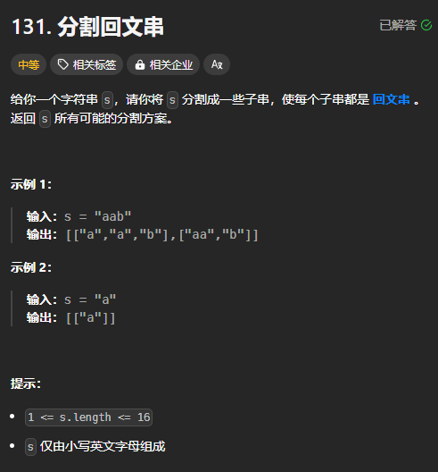
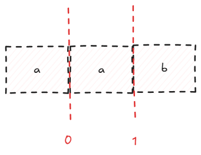
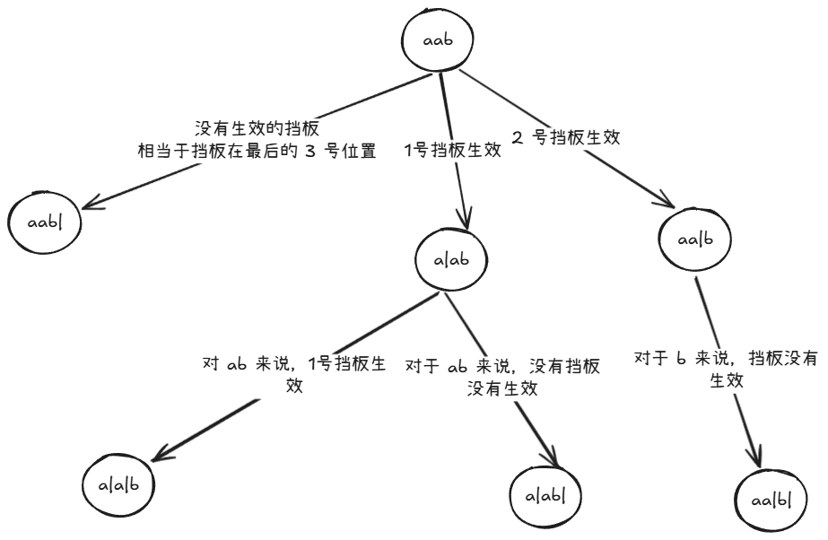

题目链接：[https://leetcode.cn/problems/palindrome-partitioning/description/](https://leetcode.cn/problems/palindrome-partitioning/description/)



## 思路
可以将 “aab” 看做是每个空隙都有一个挡板：



然后分割的工作就由这些挡板来完成：

+ 如果只有 0 号挡板生效，则分割为 a 和 ab，ab 不是回文串
+ 如果只有 1 号挡板生效，则分割为 aa 和 b
+ 如果 0 和 1 号挡板都生效，则分割为 a、a 和 b

进一步地，如果挡板从 1 开始编号，那么会有很好的性质：

+ 如果只有1 号挡板生效，那么字符串就是 aab[0..1] 和 aab[1..]
+ 如果只有 2 号挡板生效，那么字符串就是 aab[0..2] 和 aab[2..]
+ 如果 1 和 2 号挡板同时生效，那么字符串就是 aab[0..1]、aab[1..2] 和 aab[2..]

并且，挡板的最大编号为 2，小于 len(aab)。

那么，接下来的思路就是决定哪些挡板生效、哪些不生效。由于要产生所有可能的分割结果，所以使用回溯来解决。可以使用下面的思路：



我们根据上图的思路，让每次递归只选择一个挡板生效，然后，将生效挡板的左侧的字符串加入到 path 中，将该挡板的右侧字符串继续传递给下一个递归。

递归的边界条件就是递下来的字符串为空。

当选择的挡板的编号刚好等于字符串的长度的时候，相当于没有挡板生效。

然后，还要判断挡板左侧的字符串是否是回文的，如果不是回文的，说明这个分割是没有效的。

## 代码
```rust
impl Solution {
    pub fn partition(s: String) -> Vec<Vec<String>> {
        fn is_palindrome_string(s: &str) -> bool {
            let s = s.as_bytes();
            let mut left = 0;
            let mut right = s.len() - 1;
            while left < right {
                if s[left] != s[right] {
                    return false;
                }
                left += 1;
                right -= 1;
            }

            true
        }
        fn dfs<'a>(s: &'a str, path: &mut Vec<&'a str>, ans: &mut Vec<Vec<String>>) {
            if s.is_empty() {
                ans.push(path.iter().map(|s| s.to_string()).collect());
                return;
            }

            // 枚举生效挡板的位置
            // 当 i 等于 s.len() 的时候，相当于没有挡板生效
            for i in 1..=s.len() {
                if is_palindrome_string(&s[..i]) {
                    // 将挡板左侧的字符串加入 path
                    path.push(&s[..i]);
                    dfs(&s[i..], path, ans);
                    // 每次递归只让一个挡板生效
                    path.pop();
                }
            }
        }

        let mut ans = vec![];
        dfs(&s, &mut vec![], &mut ans);
        ans
    }
}
```


