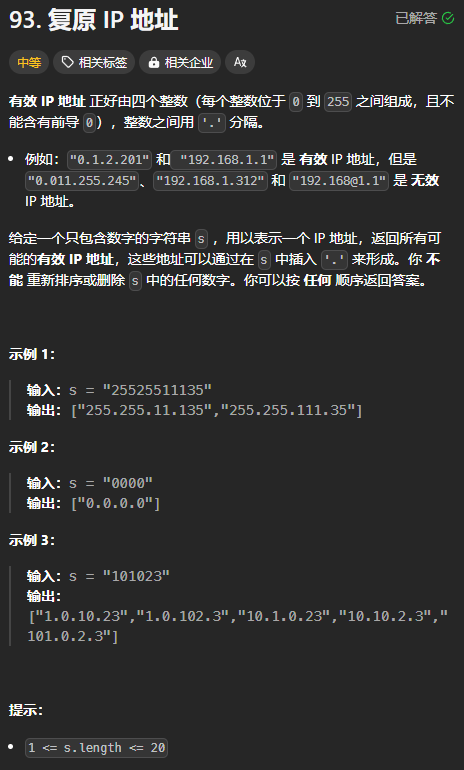
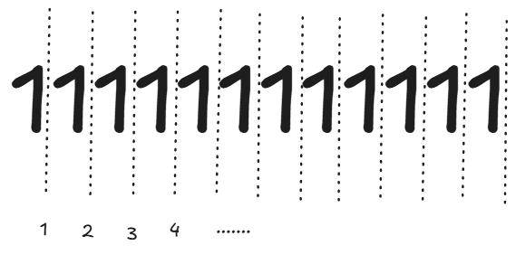
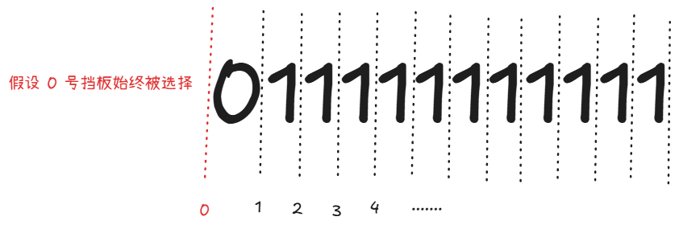

题目链接：[https://leetcode.cn/problems/restore-ip-addresses/description/](https://leetcode.cn/problems/restore-ip-addresses/description/)



## 思路
也是插入挡板：



要从所有可能的挡板中选择 3 个生效。

最后一个挡板不能被选择。

由于不能出现前导 0，所以当上一个选择的挡板的位置对应的元素等于 0，则当前选择的这个挡板必须是上一个挡板的下一个挡板：



出现上述情况的时候，我们必须要选择 1 号挡板。

优化措施：

+ 当 s.len() < 4 || s.len() > 12 时，肯定没有答案
+ 每个挡板的编号最多比上一个被选中的挡板的编号大 3
+ 当上一个挡板被选择了之后，挡板之后剩余的元素数量必须要位于 `[ 4 - 已选挡板的数量（包括 0 号挡板）, 待选的挡板数量 x 3]` 

其中，待选的挡板数量 = 4 - 已选的挡板数量（包括 0 号挡板）

使用 path 记录已选的挡板的编号。

## 代码
```rust
impl Solution {
    pub fn restore_ip_addresses(s: String) -> Vec<String> {
        if s.len() < 4 || s.len() > 12 {
            return vec![];
        }

        fn check(s: &[&str]) -> bool {
            // dfs 后的字符串的长度一定小于等于 3 了，所以不用判断

            // 只有最后一个会出现前导 0 的情况
            // 判断是否含有前导 0
            if s[s.len() - 1].as_bytes()[0] == b'0' && s[s.len() - 1].len() > 1 {
                return false;
            }

            for &segment in s {
                // 判断其大小
                if segment.parse::<u32>().unwrap() > 255 {
                    return false;
                }
            }

            true
        }

        fn dfs(index: usize, path: &mut Vec<usize>, s: &str, ans: &mut Vec<String>) {
            if path.len() == 4 {
                let result = vec![
                    &s[..path[1]],
                    &s[path[1]..path[2]],
                    &s[path[2]..path[3]],
                    &s[path[3]..],
                ];

                if check(&result) {
                    ans.push(format!(
                        "{}.{}.{}.{}",
                        result[0], result[1], result[2], result[3]
                    ));
                }
                return;
            }

            let last_selected_index = *path.last().unwrap();

            if s.as_bytes()[last_selected_index] == b'0' {
                // 上一个挡板的后面就是 0，必须要选择 index 挡板
                // 否则会出现前导 0
                path.push(index);
                dfs(index + 1, path, s, ans);
                path.pop();
            } else {
                // 每个挡板的编号最多比上一个被选中的挡板的编号大 3
                for i in index..=last_selected_index + 3 {
                    // 当一个挡板被选择了之后，挡板之后剩余的元素数量必须要位于
                    // [ 4 - 已选挡板的数量（包括 0 号挡板）, 待选的挡板数量 x 3]
                    // 这里尝试选择 i 挡板
                    let remain_n_elements = s.len() - i;
                    if remain_n_elements < (4 - path.len())
                        || remain_n_elements > (4 - path.len()) * 3
                    {
                        continue;
                    }
                    path.push(i);
                    dfs(i + 1, path, s, ans);
                    path.pop();
                }
            }
        }

        let mut ans = vec![];
        dfs(
            1,
            &mut vec![0], /* 0 号挡板一定被选 */
            &s,
            &mut ans,
        );
        ans
    }
}
```

