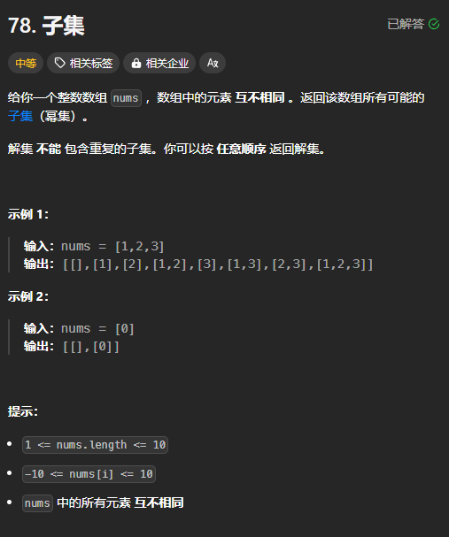

题目链接：[https://leetcode.cn/problems/subsets/description/](https://leetcode.cn/problems/subsets/description/)



## 思路
子集型回溯。

可以有 2 中角度：

+ 输入的角度：选或不选
+ 答案的角度：一定要选，每次递下去的路径都是一个答案。

注意这里答案的角度的代码，index 表示可供当前递归使用的数组为 nums[index..]。所以，代码里直接将其称为 start。

这么处理的原因是由于从答案的角度来分析的话，每次都要选一个，那么，如果不将整个数组划分为多个子数组来进行选择的话，势必会出现重复的元素。

## 代码
从输入的角度：

```rust
impl Solution {
    pub fn subsets(nums: Vec<i32>) -> Vec<Vec<i32>> {
        // 从输入的视角
        fn dfs(index: usize, path: &mut Vec<i32>, nums: &[i32], ans: &mut Vec<Vec<i32>>) {
            if index == nums.len() {
                ans.push(path.clone());
                return;
            }

            // 不选
            dfs(index + 1, path, nums, ans);

            // 选
            path.push(nums[index]);
            dfs(index + 1, path, nums, ans);
            // 恢复现场
            path.pop().unwrap();  
        }
        
        let mut ans = vec![];
        dfs(0, &mut Vec::new(), &nums, &mut ans);
        ans
    }
}
```

从答案的角度：

```rust
impl Solution {
    pub fn subsets(nums: Vec<i32>) -> Vec<Vec<i32>> {
        // 从答案的角度
        fn dfs(start: usize, path: &mut Vec<i32>, nums: &[i32], ans: &mut Vec<Vec<i32>>) {
            // 每一个递下来的路径都是一个答案
            // 如果这里提前判断 start == num.len()，就会导致 ans 中没有 DFS 树叶子节点的值
            ans.push(path.clone());

            // 可以省略下列语句，因为 start == nums.len() 的时候，不会进入循环，效果是一样的
            // if start == nums.len() {
            //     return;
            // }
            
            // 枚举选哪个
            for i in start..nums.len() {
                path.push(nums[i]);
                dfs(i + 1, path, nums, ans);
                path.pop().unwrap();  
            }      
        }

        let mut ans = vec![];
        dfs(0, &mut Vec::new(), &nums, &mut ans);
        ans
    }
}
```

