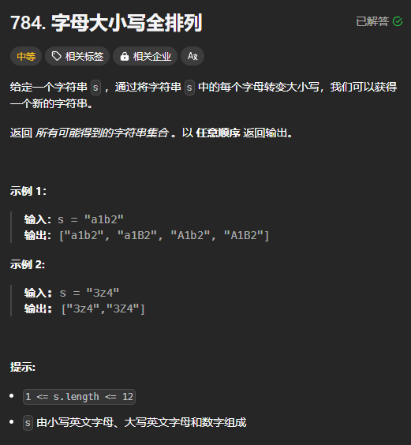

题目链接:[https://leetcode.cn/problems/letter-case-permutation/description/](https://leetcode.cn/problems/letter-case-permutation/description/)



## 代码
答案的角度：

```rust
impl Solution {
    pub fn letter_case_permutation(s: String) -> Vec<String> {
        let mut s = s.chars().collect::<Vec<_>>();

        fn dfs(index: usize, s: &mut Vec<char>, ans: &mut Vec<String>) {
            ans.push(String::from_iter(s.iter()));

            for i in index..s.len() {
                if s[i].is_alphabetic() {
                    if s[i].is_ascii_uppercase() {
                        s[i] = s[i].to_ascii_lowercase();
                        dfs(i + 1, s, ans);
                        s[i] = s[i].to_ascii_uppercase();
                    } else {
                        s[i] = s[i].to_ascii_uppercase();
                        dfs(i + 1, s, ans);
                        s[i] = s[i].to_ascii_lowercase();
                    }
                }
            }
        }

        let mut ans = vec![];
        dfs(0, &mut s, &mut ans);
        ans
    }
}
```

选或不选的角度：

```rust
impl Solution {
    pub fn letter_case_permutation(s: String) -> Vec<String> {
        let mut s = s.chars().collect::<Vec<_>>();

        fn dfs(index: usize, s: &mut Vec<char>, ans: &mut Vec<String>) {
            if index == s.len() {
                ans.push(String::from_iter(s.iter()));
                return;
            }

            // 无论 s[index] 是否是一个字符，都可以不选
            dfs(index + 1, s, ans);

            // 选, 只有是字母才可以选
            if s[index].is_ascii_alphabetic() {
                let origin = s[index];
                s[index] = if origin.is_ascii_lowercase() {
                    origin.to_ascii_uppercase()
                } else {
                    origin.to_ascii_lowercase()
                };
                dfs(index + 1, s, ans);
                s[index] = origin;
            }
        }

        let mut ans = vec![];
        dfs(0, &mut s, &mut ans);
        ans
    }
}
```

