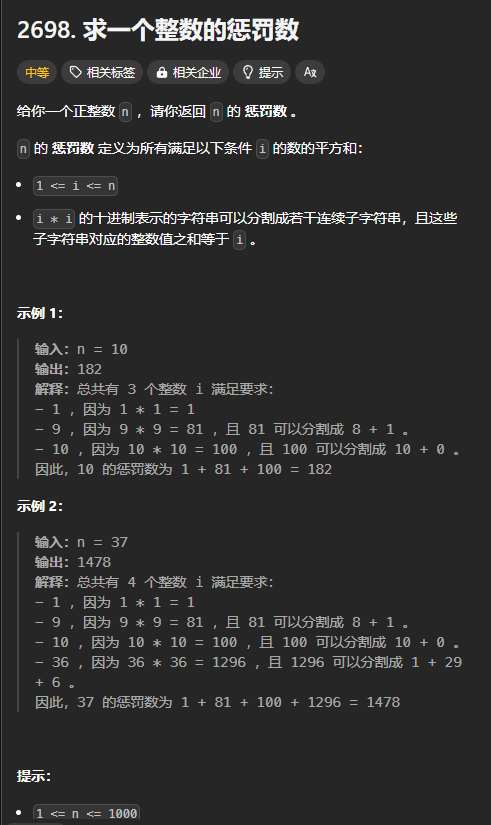
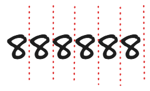

题目链接：[https://leetcode.cn/problems/find-the-punishment-number-of-an-integer/description/](https://leetcode.cn/problems/find-the-punishment-number-of-an-integer/description/)



## 思路
可以枚举 i，然后将 i * i 转换成字符串，并对其尝试进行分割，分割的结果用一个数组来存储。如果最后这些分割后的子字符串相加等于 n，则该结果数组就不为空。

下一个问题是如何分割？



可以将每个空位从 1 开始编号，这样的话，就是选择哪些挡板生效。

需要注意的一点是，字符串的最后一个挡板必须生效。不然，就有可能造成还有一部分字符串没有被解析。

我们可以将生效挡板的左侧元素解析出来加入到 sum 中，那我们还要维护一个上一个已经生效了挡板 start，这样我们才知道我们我们要解析的字符串的开始位置。

需要注意的是，题目没有说明是否允许出现前导 0 的情况，例如是否可以将 1001 分割为 10 + 01。

先按照可以出现前导 0 情况处理。

## 代码
```rust
impl Solution {
    pub fn punishment_number(n: i32) -> i32 {
        fn dfs(index: usize, start: usize, s: &str, sum: i32, n: i32) -> bool {
            if index == s.len() + 1 {
                return sum == n;
            }

            // 不让当前挡板生效
            // 最后一个挡板一定要选
            if index < s.len() && dfs(index + 1, start, s, sum, n) {
                return true;
            }

            // 让当前挡板生效
            let parsed_value = s[start..index].parse::<i32>().unwrap();
            if sum + parsed_value <= n {
                return dfs(index + 1, index, s, sum + parsed_value, n);
            }

            false
        }
        let mut sum = 0;
        // 枚举 i
        for i in 1..=n {
            if dfs(1, 0, &(i * i).to_string(), 0, i) {
                sum += i * i;
            }
        }
        sum
    }
}
```


