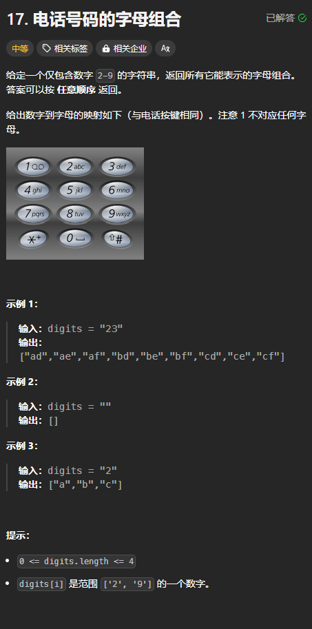

题目链接：[https://leetcode.cn/problems/letter-combinations-of-a-phone-number/description/](https://leetcode.cn/problems/letter-combinations-of-a-phone-number/description/)



## 思路
使用子集型回溯的答案视角。因为这个不涉及到选或者不选的问题，每一个节点都要进行选择，不能直接跳到下一次。但是，并不是每次递下来的 path 都是答案，只有当 path 的长度为 n 的时候，才能加入到答案中。

## 代码
```rust
impl Solution {
    const MAPPING: [&str; 10] = [
        "", "", "abc", "def", "ghi", "jkl", "mno", "pqrs", "tuv", "wxyz",
    ];
    pub fn letter_combinations(digits: String) -> Vec<String> {
        if digits.is_empty() {
            return vec![];
        }
        
        let digits = digits
            .into_bytes()
            .into_iter()
            .map(|digit| digit as usize - b'0' as usize)
            .collect::<Vec<usize>>();

        fn dfs(index: usize, path: &mut Vec<char>, digits: &[usize], ans: &mut Vec<String>) {
            // path 中一定有了 n 个字符
            if index == digits.len() {
                ans.push(String::from_iter(path.iter()));
                return;
            }

            for c in Solution::MAPPING[digits[index]].chars() {
                path.push(c);
                // 选取下一个字符串的下一个字符
                dfs(index + 1, path, digits, ans);
                // 每个字符串只能选择一个字符
                path.pop().unwrap();
            }
        }

        let mut ans = vec![];
        dfs(0, &mut Vec::new(), &digits, &mut ans);
        ans
    }
}
```

