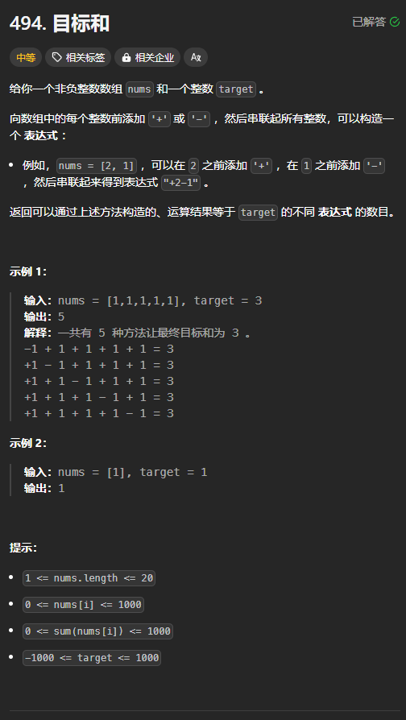

[https://leetcode.cn/problems/target-sum/description/](https://leetcode.cn/problems/target-sum/description/)



## 思路
可以这样理解，就是从 nums 中选择一些数让其变为负数。

为了快速得到数组中的元素的和，可以事先将所有元素都为正的时候的和 sum 算出来。当一个元素变为负数以后，相当于在原来的和中减去它 2 倍的值。所以，并不需要真正地改变数组中的元素。

优化措施：

+ 如果当前将某个 nums[i] 变为负数之后，sum 已经小于了 target，则可以不将其变为负数

## 代码
从答案的角度：

```rust
impl Solution {
    pub fn find_target_sum_ways(nums: Vec<i32>, target: i32) -> i32 {
        // 从答案的角度
        fn dfs(index: usize, nums: &[i32], sum: i32,target: i32, ans: &mut i32) {
            // 每次递下来的答案不一定符合条件,所以要做判断
            if sum == target {
                *ans += 1;
            }

            for i in index..nums.len() {
                let sum = sum - 2 * nums[i];
                if sum >= target {
                    dfs(i + 1, nums, sum, target, ans);
                } 
            }
        }

        let mut ans = 0;
        dfs(0, &nums, nums.iter().sum(), target, &mut ans);
        ans
    } 
}
```

从选或不选的角度：

```rust
impl Solution {
    pub fn find_target_sum_ways(nums: Vec<i32>, target: i32) -> i32 {
        // 从选或不选的角度
        fn dfs(index: usize, nums: &[i32], sum: i32,target: i32, ans: &mut i32) {
            if index == nums.len() {
                if sum == target {
                    *ans += 1;
                }
                return;
            }

           // 不选
           dfs(index + 1, nums, sum, target, ans);

           // 选
           let sum = sum - 2 * nums[index];
           if sum >= target {
                dfs(index + 1, nums, sum, target, ans);
           }
        }

        let mut ans = 0;
        dfs(0, &nums, nums.iter().sum(), target, &mut ans);
        ans
    } 
}
```

