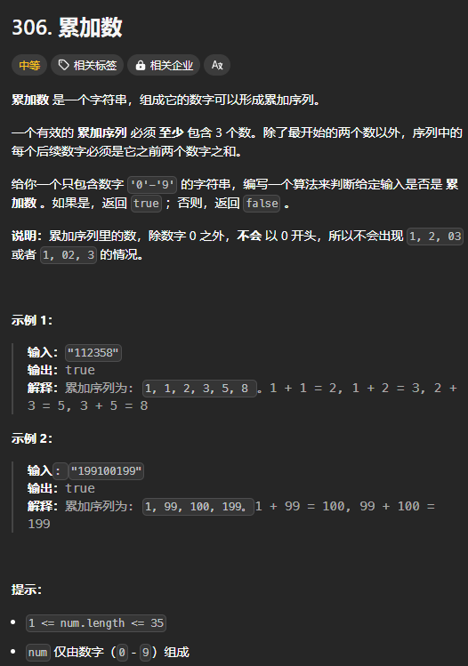
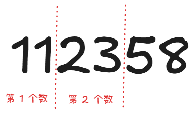
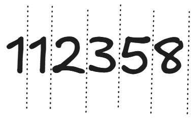
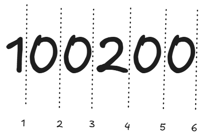

题目链接：[https://leetcode.cn/problems/additive-number/description/](https://leetcode.cn/problems/additive-number/description/)



## 思路
这题的主要变化是前 2 个数。只要前 2 个数确定了，后面的数字都是可以一一校验的。

所以，我们的目标是枚举所有可能的前 2 个数。

而且这 2 个数不能含有前导 0。

可以用 2 个挡板将任意序列分割为 2 个数：



我们可以这样看，每个数字之间都有一个挡板，然后我们只选择 2 个生效：



需要注意的是，这种方法在对于 0 时需要特殊处理：



如果当前挡板对应的元素为 0，则同时必须选择下一个挡板。

例如假设选择 2 号挡板，它对应的元素为 0,则我们必选同时选择第 3 个挡板，这样才不会导致选择出来的前 2 个元素出现前导 0 的情况。

类似的原因，当字符串的第一个数就为 0 的时候，就必须选择 1 号挡板。

我们使用 path 数组来记录选择了哪些挡板，所以当 path 等于 2 的时候，就是递归的终点。

还有一点，最后一个挡板永远不可能生效，因为如果最后一个挡板生效了，那么整个字符串就只能表示 2 个整数，而题目要求至少有 3 个整数。

## 代码
```rust
impl Solution {
    pub fn is_additive_number(num: String) -> bool {
        if num.len() < 3 {
            return false;
        }

        fn add(a: &[u8], b: &[u8]) -> Vec<u8> {
            let mut result = Vec::new();
            let mut i = a.len() as i32 - 1;
            let mut j = b.len() as i32 - 1;
            let mut carry = 0;

            // 遍历两数字的每一位
            while i >= 0 || j >= 0 || carry > 0 {
                let digit_a = if i >= 0 { a[i as usize] - b'0' } else { 0 };
                let digit_b = if j >= 0 { b[j as usize] - b'0' } else { 0 };

                let sum = digit_a + digit_b + carry;
                result.push((sum % 10) + b'0'); // 当前位
                carry = sum / 10; // 计算进位

                i -= 1;
                j -= 1;
            }

            result.reverse();
            result
        }
        fn dfs(index: usize, path: &mut Vec<usize>, num: &str) -> bool {
            if path.len() == 2 {
                // 确定前 2 个数
                let mut first = num[..path[0]].as_bytes().to_owned();
                let mut second = num[path[0]..path[1]].as_bytes().to_owned();

                let mut thrid_num_start = path[1];
                while thrid_num_start < num.len() {
                    let thrid = add(&first, &second);
                    if num[thrid_num_start..(thrid_num_start + thrid.len()).min(num.len())]
                        .as_bytes()
                        != thrid
                    {
                        return false;
                    }
                    thrid_num_start += thrid.len();
                    first = second;
                    second = thrid;
                }

                return true;
            }

            if path.is_empty() {
                // 选择第一个挡板
                // 需要为第二个挡板至少留下一个位置
                // 如果第一个元素为 0，则必须选择它，不然会出现前导 0
                if num.as_bytes()[0] == b'0' {
                    path.push(1);
                    if dfs(2, path, num) {
                        return true;
                    }
                    path.pop();
                } else {
                    for i in 1..=num.len() - 2 {
                        path.push(i);
                        if dfs(i + 1, path, num) {
                            return true;
                        }
                        path.pop();
                    }
                }
            } else {
                // 选择第二个挡板
                if num.as_bytes()[path[0]] == b'0' {
                    // 必须选择 index，否则会出现前导 0
                    path.push(index);
                    if dfs(index + 1, path, num) {
                        return true;
                    }
                    path.pop();
                } else {
                    for i in index..=num.len() - 1 {
                        path.push(i);
                        if dfs(i + 1, path, num) {
                            return true;
                        }
                        path.pop();
                    }
                }
            }

            false
        }

        dfs(0, &mut vec![], &num)
    }
}
```

