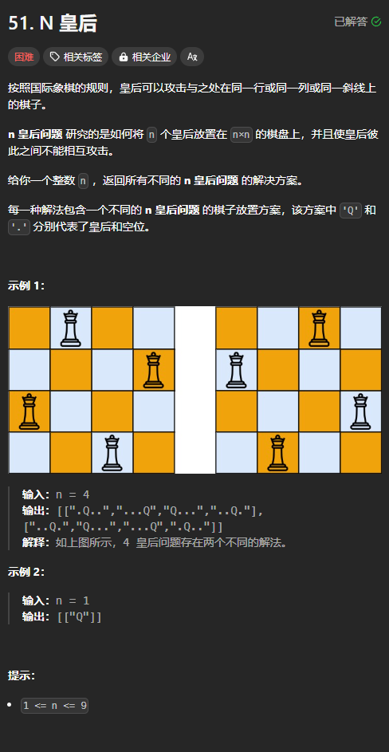

题目链接：[https://leetcode.cn/problems/n-queens/description/](https://leetcode.cn/problems/n-queens/description/)



## 思路
由题意，我们知道每行棋盘都有一个一个皇后，同样的，每一列都有一个皇后。

我们给皇后从 0 开始编号，这样的话，我们就固定每个皇后只能在对应的行。

所以，对于每个皇后来说，能变化的只能是它的列。我们就遍历它所有可能的列。

我们从 0 行开始，往下构造答案。

那么，对于第 1 行来说，它不能在与第 0 号皇后相同的列。同时，也要注意它的斜线不能有皇后。

我们从左至右遍历列，那么，（1,3）斜线的位置包含左下角的 (2, 1)、(3, 0) 和 右上角的 (0, 4) 左上角的 (0, 2) 。

总结出 (x, y) 的斜线上的坐标：

+ 左下角：(x + 1, y - 1)
+ 右上角：(x - 1, y + 1)
+ 左上角: （x - 1, y - 1）
+ 右下角：（x + 1, y + 1）

由于我们是从第 0 行开始往下构造答案，所以，我们不需要考虑左下角的位置是否有其它皇后，因为这时左下角的皇后我们还没有确定。同样的原因，不需要考虑右下角。

所以，对于每个坐标，我们只需要确定 2 个方向是否有其它皇后：

+ up 方向（相同列）
+ 右上角
+ 左上角

由于 n 小于等于 9，我们可以使用一个整数来快速判断当前列有没有其他的皇后。

如果某个皇后始终在这行找不到安生的位置，就说明前面选择得不对，提前返回。只要不再递归，那么就是提前返回。

## 代码
```rust
impl Solution {
    pub fn solve_n_queens(n: i32) -> Vec<Vec<String>> {
        let n = n as usize;

        // 棋盘
        let mut board = vec![".".repeat(n).chars().collect::<Vec<_>>(); n];
        fn dfs(row: usize, selected_cols: u32, board: &mut [Vec<char>], ans: &mut Vec<Vec<String>>) {
            if row == board.len() {
                ans.push(board.iter().map(|chars| String::from_iter(chars.iter())).collect());
                return;
            }

            for (col, c) in board[row].clone().into_iter().enumerate() {
                // 尝试选择 (row, col) 位置
                if selected_cols >> col & 1 == 0 {
                    // 左上角是否有皇后
                    let mut left_up = false;
                    let (mut x, mut y) = (row, col);
                    while x as i32 >= 0 && y as i32 >= 0 {
                        left_up |= board[x][y] == 'Q';
                        x -= 1;
                        y -= 1;
                    }
                    
                    // 右上角是否有皇后
                    let mut right_up = false;
                    let (mut x, mut y) = (row, col);
                    while x as i32 >= 0 && y < board.len() {
                        right_up |= board[x][y] == 'Q';
                        x -= 1;
                        y += 1;
                    }

                    if !left_up && !right_up {
                        board[row][col] = 'Q';
                        dfs(row + 1, selected_cols | (1 << col), board, ans);
                        board[row][col] = '.';
                    }
                }
            }
        }

        let mut ans = vec![];
        dfs(0, 0, &mut board, &mut ans);
        ans
    }
}
```

