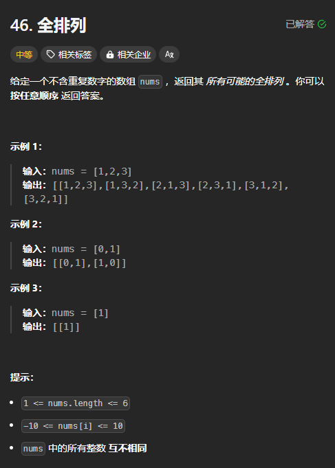

题目链接：[https://leetcode.cn/problems/permutations/description/](https://leetcode.cn/problems/permutations/description/)



## 思路
与子集型回溯的不同点在于当选择了 index = 2 的时候，下一个递归过程还可以选择 index = 1。所以，我们要维护哪些 index 被选过了，哪些没有选过。由于 nums.length <= 6,所以可以使用位运算来存储被选过的 index。

每次递归的 index 都从 0 开始。

对于每个 index，都有选或不选两种情况。

## 代码
```rust
impl Solution {
    pub fn permute(nums: Vec<i32>) -> Vec<Vec<i32>> {
        fn dfs(path: &mut Vec<i32>, selected_index: u8, nums: &[i32], ans: &mut Vec<Vec<i32>>) {
            if path.len() == nums.len() {
                ans.push(path.clone());
            }

            for i in 0..nums.len() {
                if selected_index >> i & 1 == 0 {
                    // 选
                    path.push(nums[i]);
                    dfs(path, selected_index | (1 << i), nums, ans);
                    // 不选
                    path.pop();
                }  
            }
        }

        let mut ans = vec![];
        dfs(&mut vec![], 0, &nums, &mut ans);
        ans
    }
}
```

