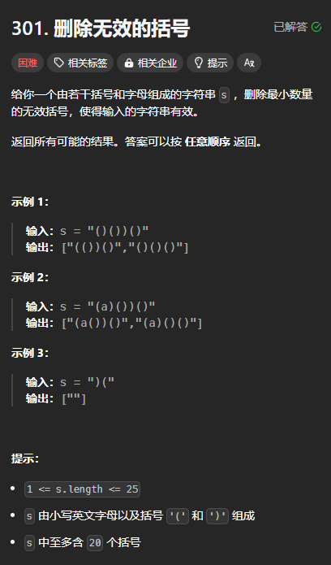
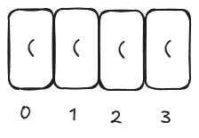
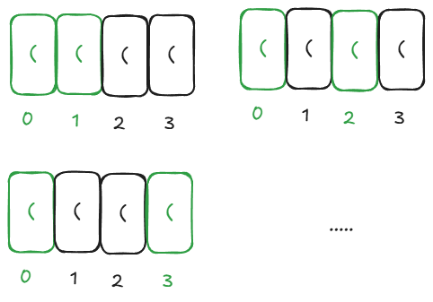
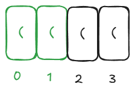

题目链接：[https://leetcode.cn/problems/remove-invalid-parentheses/description/](https://leetcode.cn/problems/remove-invalid-parentheses/description/)



## 思路
有效的括号有如下规律：

+ **从左到右遍历，左括号的数量始终大于等于右括号的数量**
+ **遍历结束后，左括号的数量等于右括号的数量**

所以，我们可以在遍历的过程中分别统计左右括号的数量。

但是，有一个更方便的方法：

规定左括号的得分为 1,右括号的得分为 -1，这样的话，可以用一个变量 score 就可以表示左右括号的数量关系：

+ 如果 score 小于 0，则说明右括号的数量大于左括号的数量
+ 如果 score 大于等于 0，则说明左括号的数量大于等于右括号的数量

题目要求删除最小数量的无效括号，那我们如何判断要删除多少个呢？

我们可以从左向右遍历：

+ 遇到的左括号都假设要被删除
+ 如果遇到了右括号，且左括号的数量大于 0，则说明可以组成一对有效的括号，则左括号被删除的数量减一；若左括号的数量等于 0，则此右括号一定要被删除

这样的话，我们就得到了要被删除多少个括号，进而得到了最终结果字符串的长度。

接下来，我们可以遍历整个字符串：

+ 对于遇到的括号，无论是左括号还是右括号，都有选或不选两种情况
+ 对于遇到的字母，一定要被选
+ 遍历的过程中，为了保证括号有效，保证左括号的数量大于等于右括号的数量
+ 可以在遍历的过程中，使用一个变量 path 来维护已经被选中的了的元素
+ 对于 `((()` 这种情况，如果每个括号都有选或不选的情况，则答案会有 3 个相同的 `()`，必须进行去重：
    - 可以使用 HashSet 来存储答案
    - 可以使用下面的去重逻辑

## 代码
### 输入角度
```rust
use std::collections::HashSet;

impl Solution {
    pub fn remove_invalid_parentheses(s: String) -> Vec<String> {
        fn dfs(index: usize, path: &mut Vec<char>, socre: i32, exptect_result_len: usize, s: &[char], ans: &mut HashSet<String>) {
            // 在遍历的过程中，始终保证左括号的数量大于等于右括号的数量
            if socre < 0 || path.len() > exptect_result_len {
                return;
            }

            if index == s.len() {
                if socre == 0 && path.len() == exptect_result_len {
                    ans.insert(String::from_iter(path.iter()));
                }
                return;
            }

            match s[index] {
                '(' | ')' => {
                    // 不选
                    dfs(index + 1, path, socre, exptect_result_len, s, ans);

                    // 选
                    path.push(s[index]);
                    dfs(index + 1, path, socre + if s[index] == '(' { 1 } else { -1 }, exptect_result_len, s, ans);
                    path.pop();
                }
                other => {
                    // 其余字符一定要被选
                    path.push(other);
                    dfs(index + 1, path, socre, exptect_result_len, s, ans);
                    path.pop();
                }
            }
        }

        let s = s.chars().collect::<Vec<_>>();
        let mut left_remove = 0;
        let mut right_remove = 0;
        for &c in &s {
            if c == '(' {
                left_remove += 1;
            } else if c == ')' {
                if left_remove > 0 {
                    left_remove -= 1;
                } else {
                    right_remove += 1;
                }
            }
        }

        let mut ans = HashSet::new();
        dfs(0, &mut vec![], 0, s.len() - left_remove - right_remove, &s, &mut ans);
        ans.into_iter().collect()
    }
}
```

### 答案角度
```rust
use std::collections::HashSet;

impl Solution {
    pub fn remove_invalid_parentheses(s: String) -> Vec<String> {
        fn dfs(index: usize, path: &mut Vec<char>, socre: i32, exptect_result_len: usize, s: &[char], ans: &mut Vec<String>) {
            // 在遍历的过程中，始终保证左括号的数量大于等于右括号的数量
            if socre < 0 || path.len() > exptect_result_len {
                return;
            }

            if socre == 0 && path.len() == exptect_result_len {
                ans.push(String::from_iter(path.iter()));
                return;
            }

            // 枚举选哪个
            for i in index..s.len() {
                // 去重
                if i > index && s[i] == s[i - 1] {
                    continue;
                }
                path.push(s[i]);
                dfs(i + 1, path, socre + if s[i] == '(' { 1 } else if s[i] == ')' { -1 } else { 0 }, exptect_result_len, s, ans);
                path.pop();
            }
        }

        let s = s.chars().collect::<Vec<_>>();
        let mut left_remove = 0;
        let mut right_remove = 0;
        for &c in &s {
            if c == '(' {
                left_remove += 1;
            } else if c == ')' {
                if left_remove > 0 {
                    left_remove -= 1;
                } else {
                    right_remove += 1;
                }
            }
        }

        let mut ans = vec![];
        dfs(0, &mut vec![], 0, s.len() - left_remove - right_remove, &s, &mut ans);
        ans
    }
}
```

注意，上述答案角度的代码引入了一个全新的去重逻辑：

#### 去重逻辑
对于



我们希望它能被选中的数量分别是 0、1、2、3、4，但是，假设被选中的数量是 2，则会出现下面这几种重复的情况：



所以，我们去重的思路是固定一个顺序，当选中的数量是 2 的时候，只能是紧挨在一起的这种情况：



而 index 指针完美符合了上述的去重逻辑：

+ 首先，它是自增的
+ 其次，它指向的每个元素都必须选择。这意味着当 index = 1 的时候，index = 0 的元素一定被加入到了 path 中，这就达成了上述固定顺序的情况

所以，我们让连续相同的括号只能被 index 指针选中，而不能被 i 指针所选中。

由于这个去重逻辑要求 index 指针前面的一个元素一定被选中，所以，对于输入角度的代码来说，这个去重逻辑无法使用。

