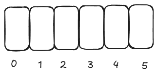

题目链接：[https://leetcode.cn/problems/generate-parentheses/description/](https://leetcode.cn/problems/generate-parentheses/description/)


## 思路
相当于在 2 * n 个位置中，选择一些位置作为左括号，没有选择到的位置就填右括号就可以了。



其中，要选择 n 个元素作为左括号。并且，左括号的位置不能是最后一个位置。

0 号位置必须是左括号。

很重要的一点是：

当右括号的数量等于左括号的数量的时候，必须选择该位置。换句话说，**在选择的过程中，必选确保已确定的左括号的数量大于等于右括号的数量。**

假设当前尝试选择的左括号位置是 index，已选的左括号的数量为 cnt，则当前已确定的右括号的数量是 index - cnt，则如果 cnt == index - cnt，则必须选择该 index。


例如，上图 2 的位置必须被选择，否则不是有效的括号。

由于 n <= 8，所以，最多有 16 个位置，所以用一个 u16 的整数足以表示哪些位置被选择了。同时，另外得用一个变量存储当前选择了的个数。否则遍历整数来看选择了多少个位置的话很麻烦。

## 代码
选或不选的角度：

```rust
impl Solution {
    pub fn generate_parenthesis(n: i32) -> Vec<String> {
        // 选或不选
        fn dfs(index: usize, path: u16, selected_cnt: usize, n: usize, ans: &mut Vec<String>) {
            if index == 2 * n - 1 {
                if selected_cnt == n {
                    let mut s = String::new();
                    for i in 0..2 * n {
                        if (path >> i) & 1 == 1 {
                            s.push('(');
                        } else {
                            s.push(')');
                        }
                    }
                    ans.push(s);
                }
                return;
            }

            // 不选
            if selected_cnt != index - selected_cnt {
                dfs(index + 1, path, selected_cnt, n, ans);
            }

            // 选
            dfs(index + 1, path | (1 << index), selected_cnt + 1, n, ans);
        }

        let mut ans = vec![];
        // 0 号位置必须被选择，所以，从 1 开始进行选择
        dfs(1, 1, 1, n as usize, &mut ans);
        ans
    }
}
```

