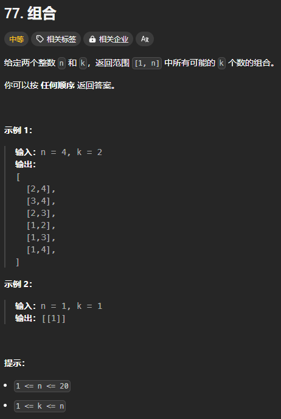

题目链接：[https://leetcode.cn/problems/combinations/](https://leetcode.cn/problems/combinations/)



## 思路
可以使用子集型回溯的思路，但是我们不需要所有的子集，而是只要包含 k 个元素的子集。所以，最简单的做法就是在子集型回溯的思路上添加一个判断，看 path 的长度是否是 k。

优化措施：

+ 如果当前选择的元素的后面的元素数量已经小于了所需的最小数量，则不用再递归后面的元素了。

## 代码
选或不选的角度：

```rust
impl Solution {
    pub fn combine(n: i32, k: i32) -> Vec<Vec<i32>> {
        // 选或不选的角度
        fn dfs(index: usize, n: usize, k: usize, path: &mut Vec<i32>, ans: &mut Vec<Vec<i32>>) {
            if index == n + 1 {
                if path.len() == k {
                    ans.push(path.clone());
                }
                return;
            }

            // 不选
            dfs(index + 1, n, k, path, ans);

            // 选
            // 剪枝优化
            if n - index >= k - (path.len() + 1) {
                path.push(index as i32);
                dfs(index + 1, n, k, path, ans);
                path.pop();
            }
        }

        let mut ans = vec![];
        dfs(1, n as usize, k as usize, &mut vec![], &mut ans);
        ans
    }
}
```

答案的角度：

```rust
impl Solution {
    pub fn combine(n: i32, k: i32) -> Vec<Vec<i32>> {
        // 答案的角度
        fn dfs(index: usize, path: &mut Vec<i32>, ans: &mut Vec<Vec<i32>>, n: usize, k: usize) {
            if path.len() == k {
                ans.push(path.clone());
                return;
            }

            for i in index..=n {
                // 尝试选择 i
                if n - i >= k - (path.len() + 1) {
                    path.push(i as i32);
                    dfs(i + 1, path, ans, n, k);
                    path.pop();
                } else {
                    break;
                }
            }
        }

        let mut ans = vec![];
        dfs(1, &mut vec![], &mut ans, n as usize, k as usize);
        ans
    }
}
```

