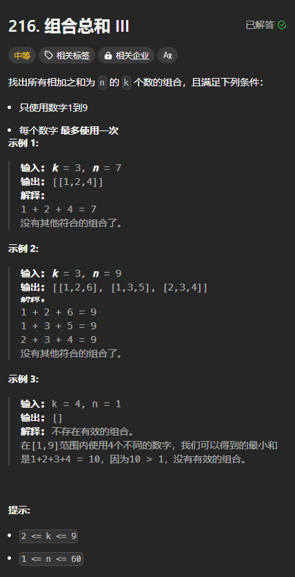

题目链接：[https://leetcode.cn/problems/combination-sum-iii/description/](https://leetcode.cn/problems/combination-sum-iii/description/)



## 思路
选或不选，而且必须选 k 个。同样的，是数组 [1..=9] 的一个子集，可以使用子集型回溯的思路来做。

优化措施:

+ 如果尝试选择 i（还没有将其加入 path 中），而后面的 9 - i  个元素少于 k - (path.len() + 1) 个元素，则不用继续递归了
+ 如果当前 path 中元素的总和 sum 加上 k - path.len()  个最大的数的和都小于 n，则说明前面选择得太小了，不继续递归
+ 如果当前 path 中元素的总和 sum 加上 k - path.len() 个最小的数的和都大于 n，则说明前面选择得太大了，不继续递归

## 代码
选或不选的角度：

```rust
impl Solution {
    pub fn combination_sum3(k: i32, n: i32) -> Vec<Vec<i32>> {
        // 选或不选的角度
        fn dfs(index: usize, path: &mut Vec<i32>, sum: i32, ans: &mut Vec<Vec<i32>>, k: usize, target: i32) {
            if index == 10 {
                if path.len() == k && sum == target {
                    ans.push(path.clone());
                }
                return;
            }

            // 不选
            dfs(index + 1, path, sum, ans, k, target);

            // 选
            // 9 - index >= k - (path.len() + 1) 等价于 10 - index >= k - path.len()
            if 10 - index >= k - path.len() // index 后面的元素数量要大于等于后面所需要的元素数量
                && sum + (index as i32..).take(k - path.len()).sum::<i32>() <= target // sum 加上后面的最小 k - path.len() 个元素要小于等于 target
                && sum + (1..=9).rev().take(k - path.len()).sum::<i32>() >= target // sum 加上后面的最大 k - path.len() 个元素要大于等于 target 
            {
                path.push(index as i32);
                dfs(index + 1, path, sum + index as i32, ans, k, target);
                path.pop();
        }

        let mut ans = vec![];
        dfs(1, &mut vec![], 0, &mut ans, k as usize, n);
        ans
    }
}
```

答案的角度：

```rust
impl Solution {
    pub fn combination_sum3(k: i32, n: i32) -> Vec<Vec<i32>> {
        // 答案的角度
        fn dfs(index: i32, path: &mut Vec<i32>, sum: i32, ans: &mut Vec<Vec<i32>>, k: usize, target: i32) {
            if path.len() == k {
                if sum == target {
                    ans.push(path.clone());
                }
                return;
            }

            for i in index..=9 {
                if 10 - i as usize >= k - path.len()
                    && sum + (i..).take(k - path.len()).sum::<i32>() <= target 
                    && sum + (1..=9).rev().take(k - path.len()).sum::<i32>() >= target
                {
                    path.push(i);
                    dfs(i + 1, path, sum + i, ans, k, target);
                    path.pop();
                } else {
                    break;
                }
            }
        }

        let mut ans = vec![];
        dfs(1, &mut vec![], 0, &mut ans, k as usize, n);
        ans
    }
}
```

