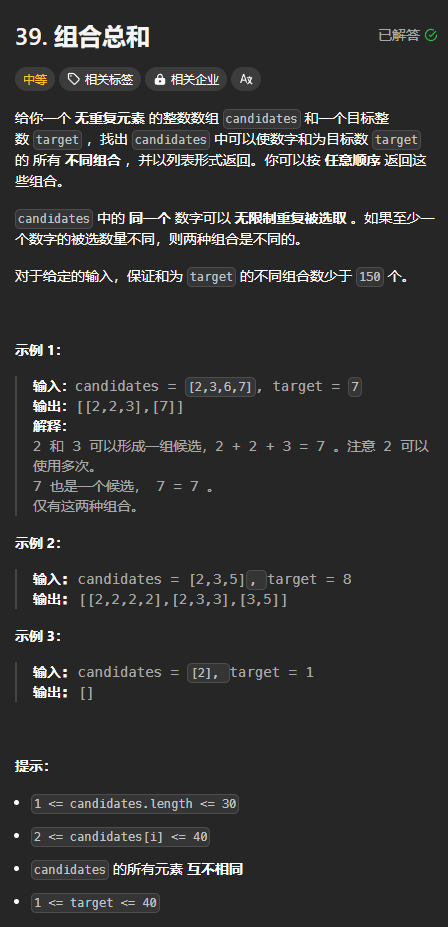

题目链接：[https://leetcode.cn/problems/combination-sum/description/](https://leetcode.cn/problems/combination-sum/description/)



## 思路
这题主要的亮点在于同一个元素可以选多次，这样的话，可以这样：

对于 dfs(i)，如果选择 i 的话，它的下一个递归还是 dfs(i)，而不是 dfs(i + 1)。

由于要知道被选择了的元素的和，所以还要维护一个变量 sum。

需要注意的是，递归的边界条件一定要加一个 sum > target，否则，就会导致无止境地递归某一个元素值。

或者我们可以用 target 来变相地表示 sum，当 target = 0 的时候，就说明 sum == target。这样就不用多维护一个递归参数了。

## 代码
### 输入角度
```rust
impl Solution {
    pub fn combination_sum(candidates: Vec<i32>, target: i32) -> Vec<Vec<i32>> {
        // 输入角度
        fn dfs(index: usize, path: &mut Vec<i32>, sum: i32, target: i32, candidates: &[i32], ans: &mut Vec<Vec<i32>>) {
            if sum > target || index == candidates.len() {
                if sum == target {
                    ans.push(path.clone());
                }
                return;
            }

            // 不选
            dfs(index + 1, path, sum, target, candidates, ans);

            // 选
            path.push(candidates[index]);
            // 不是 dfs(index + 1,...)
            dfs(index, path, sum + candidates[index], target, candidates, ans);
            path.pop();
        }
        
        let mut ans = vec![];
        dfs(0, &mut vec![], 0, target, &candidates, &mut ans);
        ans
    }
}
```

### 答案角度
```rust
impl Solution {
    pub fn combination_sum(candidates: Vec<i32>, target: i32) -> Vec<Vec<i32>> {
        // 答案角度
        fn dfs(index: usize, path: &mut Vec<i32>, sum: i32, target: i32, candidates: &[i32], ans: &mut Vec<Vec<i32>>) {
            if sum >= target {
                if sum == target {
                    ans.push(path.clone());
                }
                return;
            }

            for i in index..candidates.len() {
                path.push(candidates[i]);
                // 不是 dfs(i + 1,...)
                dfs(i, path, sum + candidates[i], target, candidates, ans);
                path.pop();
            } 
        }
        
        let mut ans = vec![];
        dfs(0, &mut vec![], 0, target, &candidates, &mut ans);
        ans
    }
}
```

