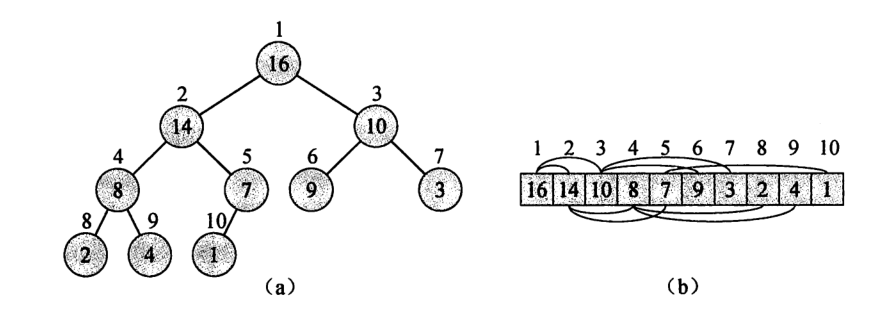
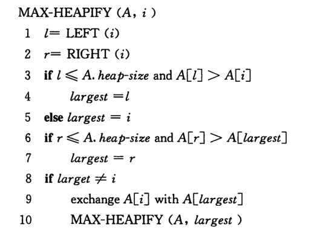

## 二叉堆
**二叉堆**是一个数组，可以被看成一个近似的完全二叉树，除了最底层之外，该树是完全充满的。

二叉堆与其数据结构：



对于给定一个节点的下标 i：

+ 左孩子的下标： 2i
+ 右孩子的下标： 2i + 1
+ 父节点的下标：i / 2

### 最大堆的维护过程
1. 从根节点的下标 i 开始，找到其左孩子节点 left 和右孩子节点 right
2. 使下标 i 处的位置为 3 者之间的最大值
3. 如果最大值不是 i，而是 i 的孩子节点，则对最大值的那个子节点递归调用此方法

伪代码：



MAX-HEAPFY 的时间复杂度为 O(h),h 为树高为 h 的节点

### 建堆
采用自底向上的方法：

1. 将新加入堆中的元素添加到堆的最后
2. 对堆中的根节点都调用一个 MAX-HEAPFY，从而构建出一个最大堆

堆中的根节点就是堆中一半元素的位置往前的元素，即 heap[0..heap.len() / 2] 的元素

这个过程也可以适用于一个无序的数组，其中，堆的大小就是数组的长度。可以在线性时间 O(n) 内，将一个无序数组构建成一个最大堆。

## 堆排序
一般堆排序都是使用最大堆，优先队列一般采用最小堆。

### 代码
```rust
fn heap_sort(nums: &mut [i32]) {
    to_max_heap(nums);
    // 堆中的位置 0 总是数组中最大的元素
    for i in (1..nums.len()).rev() {
        nums.swap(i, 0);
        max_heapfy(&mut nums[..i], 0);
    }

    // ==================== HEAP ============================
    // 可以线性时间构建出一个堆
    fn to_max_heap(nums: &mut [i32]) {
        // 自低向上构建出一个堆
        // 前一半的元素为父节点
        for i in (0..=nums.len() / 2).rev() {
            max_heapfy(nums, i);
        }
    }
    fn max_heapfy(nums: &mut [i32], i: usize) {
        // 从 i、left、right 三者中找到最大值
        let mut largest = i;

        let left = left(i);
        let right = right(i);
        if left < nums.len() && nums[left] > nums[largest] {
            largest = left;
        }
        if right < nums.len() && nums[right] > nums[largest] {
            largest = right;
        }

        // 如果最大值为子节点，则需要对子节点也进行堆化
        if largest != i {
            nums.swap(i, largest);
            max_heapfy(nums, largest);
        }
    }
    #[inline(always)]
    fn left(i: usize) -> usize {
        i << 1
    }
    #[inline(always)]
    fn right(i: usize) -> usize {
        (i << 1) + 1
    }
    #[inline(always)]
    fn parent(i: usize) -> usize {
        i >> 1
    }
}
```

