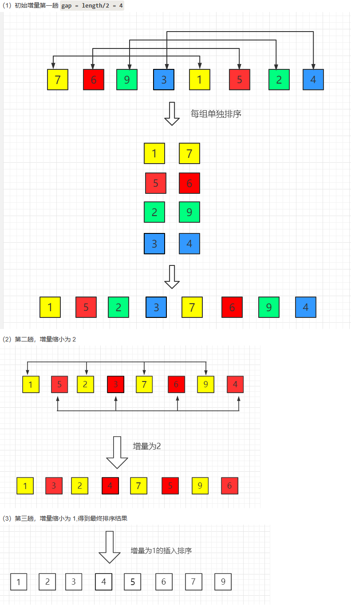

也称**递减增量排序算法**，是插入排序的一种更高效的版本。

是非稳定排序算法。

基于插入排序的 2 点性质来提出改进方法：

+ <font style="color:rgb(51, 51, 51);">插入排序在对几乎已经排好序的数据操作时，效率高，即可以达到线性排序的效率</font>
+ <font style="color:rgb(51, 51, 51);">但插入排序一般来说是低效的，因为插入排序每次只能将数据移动一位</font>

> **为什么插入排序对几乎已经排序号的数据效率很高？**
>
> 因为对于大部分已排序的序列，很快就能找到小于 key 的元素，从而使内层循环接近于一个常量，进而外层循环接近线性时间
>

---

图解：



注意，上图中，当增量为 2 的时候， 9 可以和 7、2、1进行比较，7 可以和 2、1进行比较，而不是 9 只能和 7 进行比较，7 只能和 2 进行比较。

## 核心思路
利用插入排序在差不多已经排好序的数组中，效率很高的性质，并且在小数组中这个算法耗时不是很长的特点，将原数组主动划分出多个小数组来进行插入排序。

最开始时，每个小数组的元素很少，即使对这个小数组使用插入排序，也不会耗时很长。

随着算法的运行，每个数组的元素越来越多，但是，这时候整体而言，整个数组也开始变得有序了（差不多已经排好序了），这时候再运行插入排序效率也是很高的。

## 代码
```rust
pub fn shell_sort(nums: &mut [i32]) {
    let n = nums.len();
    let mut gap = n / 2;

    while gap > 0 {
        // 和插入排序是一样的算法，只是有一些小改动
        for i in gap..n {
            let key = nums[i];
            let mut j = i;

            while j >= gap && nums[j - gap] > key {
                nums[j] = nums[j - gap];
                j -= gap;
            }
            nums[j] = key;
        }
        
        // 缩小增量
        gap /= 2;
    }
}
```

