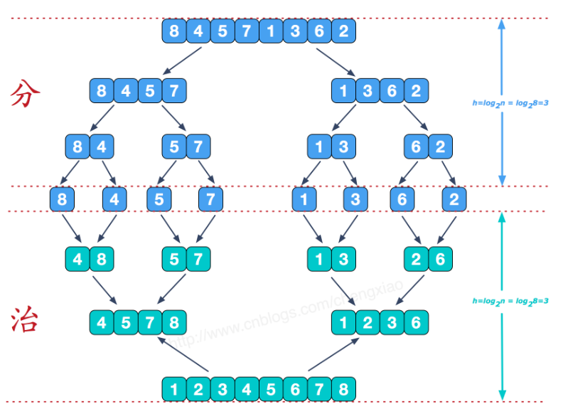

归并排序的算法性能不受输入数据的影响，始终都是 O(NlogN)，代价是需要额外的空间。

算法的核心是**分治策略（divide and conquer）**：



## 代码
```rust
pub fn merge_sort(nums: &mut [i32], temp: &mut [i32]) {
    if nums.len() == 1 {
        return;
    }

    let medium = nums.len() / 2;
    // 分
    merge_sort(&mut nums[0..medium], temp);
    merge_sort(&mut nums[medium..], temp);

    // 治
    merge(nums, 0, medium, medium, nums.len(), temp);

    fn merge(
        nums: &mut [i32],
        mut left_start: usize,
        left_end: usize,
        mut right_start: usize,
        right_end: usize,
        // temp 数组的目的是避免在 merge 函数中多次分配内存
        temp: &mut [i32],
    ) {
        let mut temp_pointer = 0;

        while left_start < left_end && right_start < right_end {
            if nums[left_start] <= nums[right_start] {
                temp[temp_pointer] = nums[left_start];
                left_start += 1;
            } else {
                temp[temp_pointer] = nums[right_start];
                right_start += 1;
            }
            temp_pointer += 1;
        }
        
        // 将 left 中剩余的元素赋给 temp
        while left_start < left_end {
            temp[temp_pointer] = nums[left_start];
            left_start += 1;
            temp_pointer += 1;
        }

        // 将 right 中剩余的元素赋给 temp
        while right_start < right_end {
            temp[temp_pointer] = nums[right_start];
            right_start += 1;
            temp_pointer += 1;
        }

        // 将 temp[0..nums.len()] 的元素按照顺序赋给 nums
        let n = nums.len();
        nums[..].clone_from_slice(&temp[..n]);
    }
}
```

