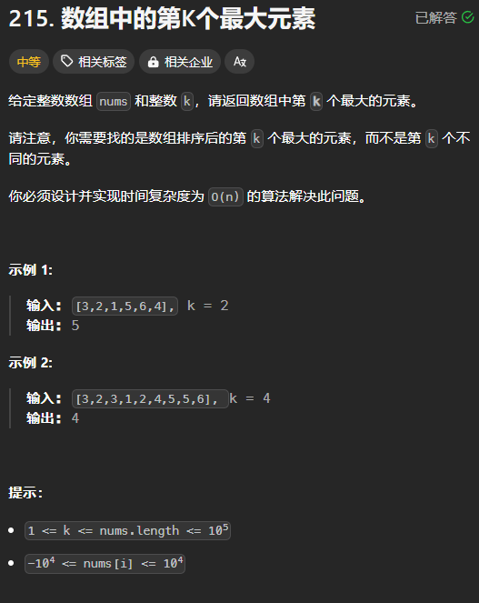

和归并排序一样，也采用**分治策略**

基本的算法步骤：

1. 从数组中选取一个枢纽元（pivot）
2. 将小于 pivot 的元素放到 pivot 的前面，大于 pivot 的元素放到 pivot 的后面。如果等于 pivot，最好是将它们均匀地分到两边
3. 分别对 pivot 前面和后面的元素重复上述步骤，直到元素的数量为 0 或者 1

pivot 的选取对整个算法效率取决定性作用

## pivot 的选取
pivot 最好的选择是数组的中位数，但是实际过程中不可能采用这种方式，故而只可以采用**三数中值分割法（Median of Three Partitioning）**来近似的选取 pivot：

选取数组的最左端，最右端、中间的数之间的中位数来近似地作为数组的中位数，以此来当 pivot

## 代码
三数中值分割法+隐藏 pivot+递归：

```rust
fn quick_sort(nums: &mut [i32]) {
    let n = nums.len();
    
    // 确保至少有 3 个元素
    if n == 2 {
        if nums[0] > nums[1] {
            nums.swap(0, 1);
        }
        return;
    } else if n <= 1 {
        return;
    }

    // 三数中值分割法
    let pivot = {
        // 使 nums[0] 为最小值
        if nums[0] > nums[n / 2] {
            nums.swap(0, n / 2);
        }
        if nums[0] > nums[n - 1] {
            nums.swap(0, n - 1);
        }

        // nums[0] 已经为最小值，剩下的就是 2 个数之间的比较了
        if nums[n / 2] > nums[n - 1] {
            nums.swap(n / 2, n - 1);
        }

        // 将 pivot 移动到数组的最后（隐藏），避开要进行分割的区域
        nums.swap(n / 2, n - 1);

        // 返回 pivot
        nums[n - 1]
    };

    // 双指针
    let mut i = 0;
    // 这里 j 必须是 n - 1,而不是 n - 2
    let mut j = n - 1;
    loop {
        // 如果 nums[i] 或者 nums[j] 等于 pivot,则同样让 i 和 j 停下来，
        // 因为这样可以避免在排序相同的元素的时候，元素聚集在一边，而另一边没有元素，
        // 造成 n^2 的复杂度
        // 模拟 while nums[++i] < pivot {}
        loop {
            i += 1;
            if nums[i] >= pivot {
                break;
            }
        }
        // 模拟 while nums[--j] > pivot {}
        loop {
            j -= 1;
            if nums[j] <= pivot {
                break;
            }
        }

        if i < j {
            // 如果 i 和 j 对应的元素都与 pivot 相同，也会执行交换操作
            nums.swap(i, j);
        } else {
            break;
        }
    }

    // 将 pivot 放置在 i 的位置上，因为此时 nums[i] 的前面后面均小于等于 pivot
    nums.swap(i, n - 1);
    quick_sort(&mut nums[..i]);

    // 这里不是 nums[i..] 的原因是，pivot 已经处在它应该在的位置上了
    quick_sort(&mut nums[i + 1..]);
}
```

但在实际的运行过程中，会发现此算法会比希尔排序或者归并排序慢，这是为什么？

有可能的一个原因是：

+ 测试用例中含有全部相同的元素，或者相同的元素很多，导致发生了很多不必要的交换，故而运行时间较长

## 核心思路
选取一个元素 pivot，将小于等于 pivot 的元素移动到其前面，大于等于 pivot 的元素移动到其后面，从而可以确定 pivot 的位置，然后分别对其前面和后面的元素执行相同的操作，进而确定每个元素的位置。

## 应用
### 寻找第 K 个最大的元素
题目链接：[https://leetcode.cn/problems/kth-largest-element-in-an-array/description/](https://leetcode.cn/problems/kth-largest-element-in-an-array/description/)



#### 思路
快速排序的过程中，当将小于等于 `pivot` 和大于等于 `pivot` 的元素都划分到了 `pivot` 的两边以后，则 `pivot` 的位置是已经确定了的，此时，可以判断该位置是否等于 `nums.len() - k`。从而，不必进行完整的快速排序。

#### 代码
```java
class Solution {
    private int targetIndex;

    public int findKthLargest(int[] nums, int k) {
        int n = nums.length;
        targetIndex = n - k;
        
        quick_sort(nums, 0, n - 1);
        return nums[targetIndex];
    }

    private void quick_sort(int[] nums, int left, int right) {
        if (right - left == 1) {
            if (nums[left] > nums[right]) {
                swap(nums, left, right);
            }
            return;
        } else if (right - left == 0) {
            return;
        }

        int mid = (left + right) / 2;
        // 三数中值分割法
        // 使 mid 位置成为 left、right 和 mid 这三个位置的数的中间一个数
        if (nums[left] > nums[mid]) {
            swap(nums, left, mid);
        }
        if (nums[left] > nums[right]) {
            swap(nums, left, right);
        }
        // 此时，nums[left] 是最小的一个元素
        if (nums[mid] > nums[right]) {
            swap(nums, mid, right);
        }

        // 将 pivot “隐藏” 数组的最后
        swap(nums, mid, right);
        int pivot = nums[right];


        // 将所有小于等于 pivot 的元素都移动到左边
        // 大于等于 pivot 的元素都移动到右边
        int i = left;
        int j = right;
        while (true) {
            while (nums[++i] < pivot) ;
            while (nums[--j] > pivot) ;

            if (i < j) {
                swap(nums, i, j);
            } else {
                break;
            }
        }
        
        // 将 pivot 放到它对应的位置上
        swap(nums, i, right);
        if (i == targetIndex) {
            // 提前结束快速排序
            return;
        }

        quick_sort(nums, left, i - 1);
        quick_sort(nums, i + 1, right);
    }

    private void swap(int[] nums, int i, int j) {
        int temp = nums[i];
        nums[i] = nums[j];
        nums[j] = temp;
    }
}
```

