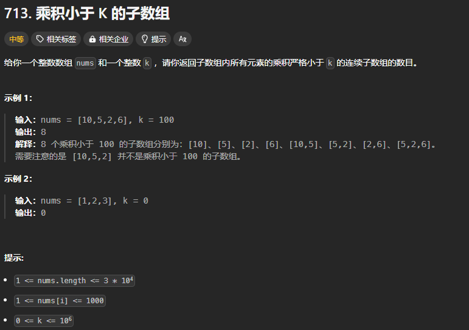

题目链接：[https://leetcode.cn/problems/subarray-product-less-than-k/description/](https://leetcode.cn/problems/subarray-product-less-than-k/description/)



## 代码
```rust
impl Solution {
    pub fn num_subarray_product_less_than_k(nums: Vec<i32>, k: i32) -> i32 {
        if k <= 1 {
            return 0;
        }

        let n = nums.len();

        let mut ans = 0;
        let mut produce = 1;
        
        let mut left = 0;
        let mut right = 0;
        while right < n {
            produce *= nums[right];

            // 如果乘积大于 K，则缩小窗口，直到符合条件
            while produce >= k {
                produce /= nums[left];
                left += 1;
            }
            
            // right - left + 1 是从 left 到 right 的符合条件的字数组的个数
            ans += (right - left) as i32 + 1;
            right += 1;
        }

        ans
    }
}
```


