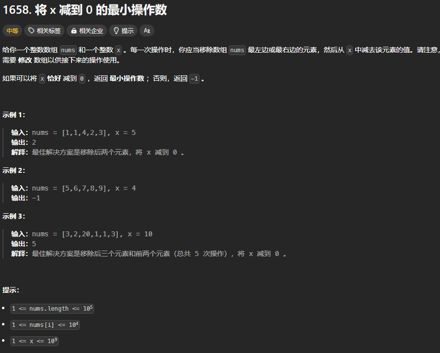

题目链接：[https://leetcode.cn/problems/minimum-operations-to-reduce-x-to-zero/description/](https://leetcode.cn/problems/minimum-operations-to-reduce-x-to-zero/description/)  


## 思路
正难则反：不去关注要移除哪些元素，而去关注要保留哪些元素。

如果刚开始的时候，就将整个数组视为一个窗口，那么我们的目的就是，在算法运行过后，使窗口外有元素能相加刚好等于 x（注意，所有元素都必须参加相加运算），同时要尽可能地使窗口的长度最大，然后统计窗口外的元素个数，就是答案。

那么，如何使窗口有元素能相加刚好等于 x 呢？

我们假设整个数组的元素和为 sum，则我们值需要使窗口内的元素和为 sum - x 则就可以保证窗口外有元素的元素和等于 x。

至于要使窗口的长度最大，并不代表我们一定要使窗口在算法结束时，它的窗口是最大的，我们只要记录它在符合条件的时候窗口长度的最大值就可以了。

## 代码
```rust
impl Solution {
    pub fn min_operations(nums: Vec<i32>, x: i32) -> i32 {
        let sum = nums.iter().sum::<i32>();
        let n = nums.len();

        // 窗口内的元素要等于这个值才算符合条件
        let target = sum - x;
        if target < 0 {
            // 由于元素都是正整数，故而不可能有答案
            return -1;
        }
        let mut window_sum = 0;
        // 初始化为 -1 的原因是窗口的长度可能为 0 但是不可能为负数
        // 窗口的长度为 0 代表数组中的所有元素之和刚好等于 x
        let mut window_max_len = -1;

        let mut right = 0;
        let mut left = 0;
        while right < n {
            window_sum += nums[right];
            while window_sum > target {
                window_sum -= nums[left];
                // 如果 window_sum_max = 5，而 nums[0] = 6,则 left += 1 会导致 left > right,但是不影响算法的运行
                left += 1;
            }
            if window_sum == target {
                window_max_len = window_max_len.max(right as i32 - left as i32 + 1);
            }
            right += 1;
        }

        if window_max_len < 0 {
            -1
        } else {
            n as i32 - window_max_len
        }
    }
}
```


