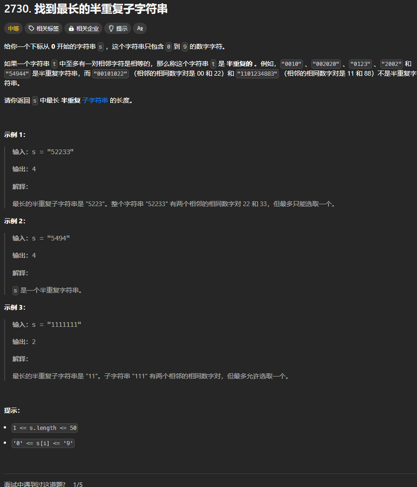

题目链接：[https://leetcode.cn/problems/find-the-longest-semi-repetitive-substring/description/](https://leetcode.cn/problems/find-the-longest-semi-repetitive-substring/description/)



## 思路
只需要确保滑动窗口内只有小于或等于一对相邻的相同元素就可以了。

## 代码
```rust
impl Solution {
    pub fn longest_semi_repetitive_substring(s: String) -> i32 {
        let s = s.into_bytes();
        let n = s.len();

        let mut have_semi_repetive_string_in_window = false;
        let mut semi_repetive_string_right_index = 0;

        // 由于 s.len() >= 1,故而答案一定大于等于 1
        let mut ans = 1;

        let mut left = 0;
        let mut right = 0;
        while right + 1 < n {
            // 将 right 加入到窗口中
            right += 1;
            // 判断由于 right 的加入，是否导致窗口内含有大于 1 个的半重复字符串
            if s[right] == s[right - 1] && have_semi_repetive_string_in_window {
                // 增加 left，消除一个半重复字符串
                left = semi_repetive_string_right_index;
                semi_repetive_string_right_index = right;
            } else if s[right] == s[right - 1] {
                have_semi_repetive_string_in_window = true;
                semi_repetive_string_right_index = right;
            }

            ans = ans.max((right - left) as i32 + 1);
        }

        ans
    }
}
```

