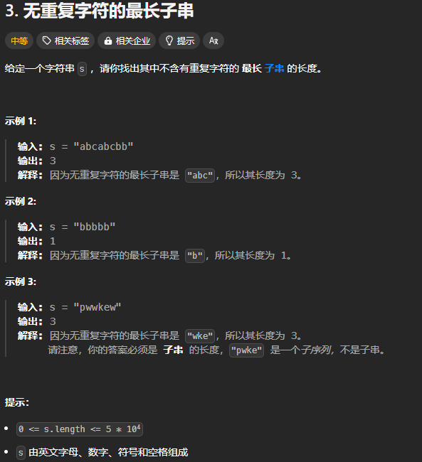

题目链接：[https://leetcode.cn/problems/longest-substring-without-repeating-characters/description/](https://leetcode.cn/problems/longest-substring-without-repeating-characters/description/)



## 思路
题目的条件是不含有重复字符的最长子串的长度，也就是说，滑动窗口内的元素不能有重复的元素，所以，可以使用一个哈希集合来存储数组中每个元素是否出现过。

还是和滑动窗口的算法一致，先增加 right，尽可能多的是窗口增大并保持窗口内的元素符合条件，如果新加入的元素不符合条件，则增加 left，来使窗口符合条件。

## 代码
```rust
impl Solution {
    pub fn length_of_longest_substring(s: String) -> i32 {
        let s = s.into_bytes();
        let n = s.len();
        
        // 英文字母、数字、符号、空格 ASCII 字符，只用 128 足以表示
        let mut cnt = [0; 128];
        let mut ans = 0;

        let mut left = 0;
        let mut right = 0;
        while right < n {
            cnt[s[right] as usize] += 1;
            if cnt[s[right] as usize] > 1  {
                // 增加 left 以使窗口内没有重复的元素
                while cnt[s[right] as usize] > 1 { 
                    cnt[s[left] as usize] -= 1;
                    left += 1;
                }
            } else {
                ans = ans.max((right - left) as i32 + 1);
            }

            right += 1;
        }

        ans
    }
}
```

