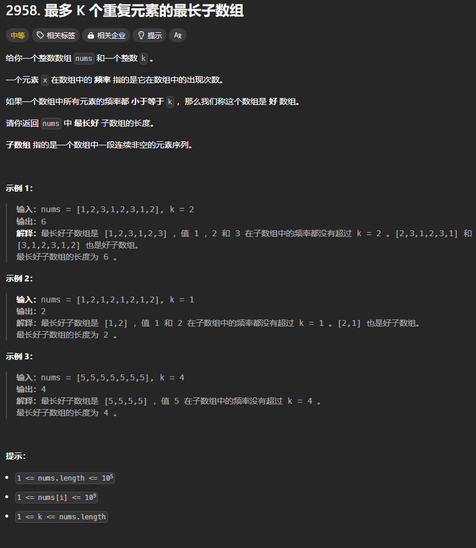

题目链接：[https://leetcode.cn/problems/length-of-longest-subarray-with-at-most-k-frequency/description/](https://leetcode.cn/problems/length-of-longest-subarray-with-at-most-k-frequency/description/)



## 思路
题目需要保持窗口中元素频率的最大值小于 k，.....。这里陷入了一个死胡同，题目只需要保证窗口内的元素的频率都不大于 K，而不一定需要要得出窗口内所有元素的频率的最大值，如果要单独维护一个最大值，是一件很麻烦的事，所以导致我半天没有思路。

我们可以这样：只要有一个元素的频率大于 k 之后，就从窗口内把超出条件数量的该元素移出去，就达到了是窗口内的每个元素的频率都小于 k 的条件。

## 代码
```rust
impl Solution {
    pub fn max_subarray_length(nums: Vec<i32>, k: i32) -> i32 {
        let n = nums.len();

        let mut cnt = std::collections::HashMap::<i32, i32>::new();
        let mut ans = 0;

        let mut left = 0;
        let mut right = 0;
        while right < n {
            // 对应元素的频率加一
            cnt.entry(nums[right]).and_modify(|cnt| *cnt += 1 ).or_insert(1);

            // 如果新加入该元素导致窗口不符合条件，则缩减窗口的大小
            while cnt[&nums[right]] > k {
                *cnt.get_mut(&nums[left]).unwrap() -= 1;
                left += 1;
            }

            ans = ans.max((right - left) as i32 + 1);
            right += 1;
        }

        ans
    }
}
```

