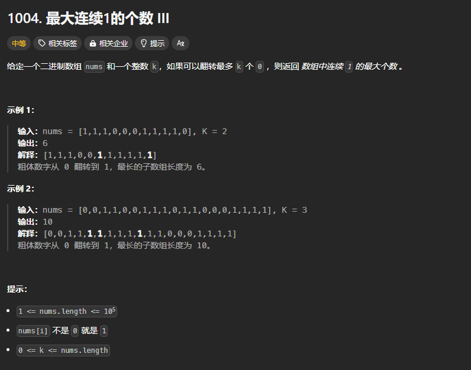

题目链接：[https://leetcode.cn/problems/max-consecutive-ones-iii/description/](https://leetcode.cn/problems/max-consecutive-ones-iii/description/)



## 思路
只需要记录下窗口内含有多少个 0 就行了，如果 0 的个数大于 k，则增加 left 缩小窗口。

## 代码
```rust
impl Solution {
    pub fn longest_ones(nums: Vec<i32>, k: i32) -> i32 {
        let mut n = nums.len();

        let mut number_of_zeros_in_window = 0;
        let mut ans = 0;
        let mut left = 0;
        for right in 0..n {
            if nums[right] == 0 {
                number_of_zeros_in_window += 1;
            }
            
            while number_of_zeros_in_window > k {
                if nums[left] == 0 {
                    number_of_zeros_in_window -= 1;
                }
                left += 1;
            }

            ans = ans.max((right - left) as i32 + 1);
        }

        ans
    }
}
```

