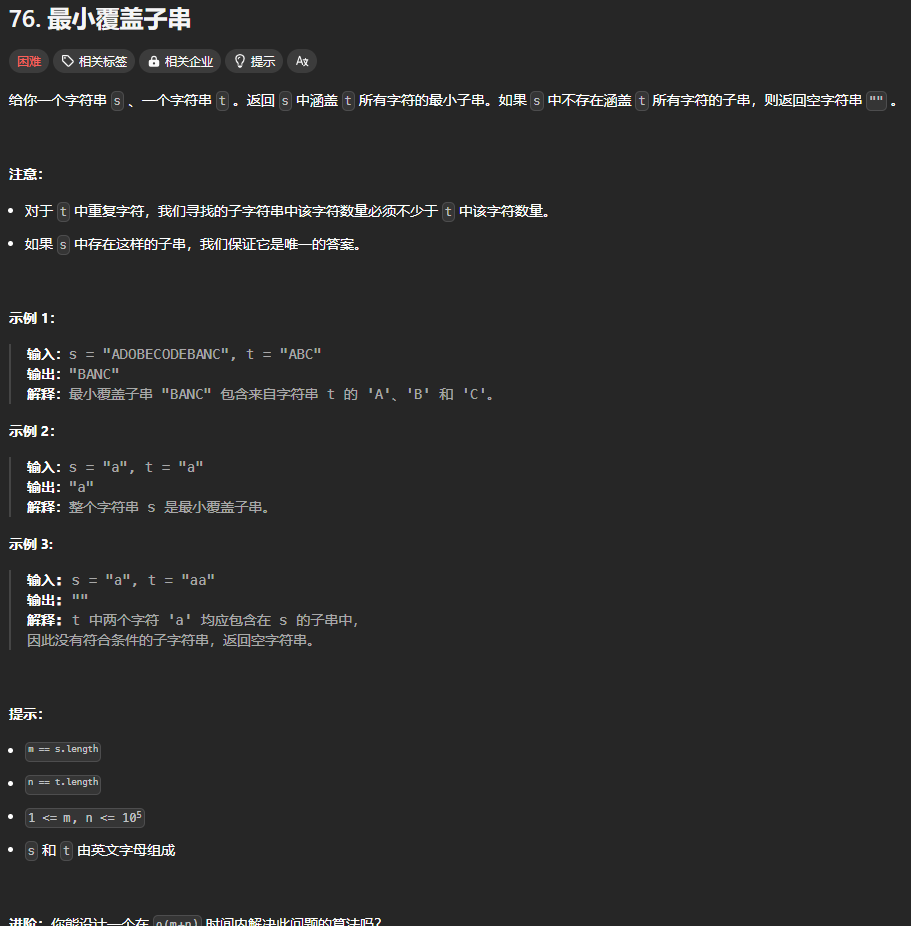

题目链接：[https://leetcode.cn/problems/minimum-window-substring/](https://leetcode.cn/problems/minimum-window-substring/)



## 代码
```rust
impl Solution {
    pub fn min_window(s: String, t: String) -> String {
        let s = s.into_bytes();
        let t = t.into_bytes();
        let m = s.len();

        // 使用 cnt 记录 t 中每个字符及其出现次数
        // 当遍历 s 的时候，如果 s 中出现了 t 中的字符，就将其减一
        // 这样的话，当 cnt 中的字符个数都小于等于 0 的时候就符合条件，可以更新答案
        let mut cnt = std::collections::HashMap::<u8, i32>::new();
        for &c in t.iter() {
            cnt.entry(c).and_modify(|cnt| *cnt += 1).or_insert(1);
        }

        // 记录 cnt hashmap 中，字符出现次数小于等于 0 的个数
        // 如果等于 cnt.len() 则说明 t 中的所有字符都被窗口中的元素所覆盖了
        let mut le_zero_cnt = 0;
        let mut ans_len = usize::MAX;
        let mut ans: &[u8] = &[];

        let mut left = 0;
        for right in 0..m {
            if let Some(cnt) = cnt.get_mut(&s[right]) {
                *cnt -= 1;
                // 只有在初次等于 0 的时候才加一
                if *cnt == 0 {
                    le_zero_cnt += 1;
                }
            }

            // 在满足条件的情况下最小化窗口的长度
            while le_zero_cnt == cnt.len()
                && if let Some(cnt) = cnt.get(&s[left]) {
                    // cnt < 0 时可以放心的将其从窗口中移除
                    *cnt < 0
                } else {
                    // 如果 t 中没有该元素，可以放心的移除
                    true
                }
            {
                if let Some(cnt) = cnt.get_mut(&s[left]) {
                    *cnt += 1;
                }

                left += 1;
            }

            if le_zero_cnt == cnt.len() && right - left + 1 < ans_len {
                ans = &s[left..=right];
                ans_len = right - left + 1;
            }
        }

        String::from_utf8(ans.to_vec()).unwrap()
    }
}
```

