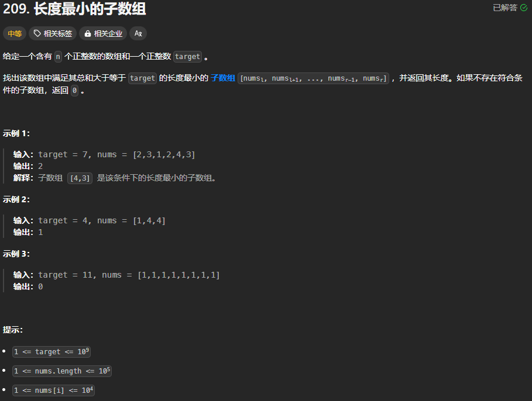

题目链接：[https://leetcode.cn/problems/minimum-size-subarray-sum/description/](https://leetcode.cn/problems/minimum-size-subarray-sum/description/)



## 思路
使用两个双指针 left 和 right，先不断地增大 right，如果当前窗口内的元素之和大于等于 target，则尝试增加 left 以减小窗口的大小，同时保证窗口内的元素仍然保持大于等于 target，以找到符合条件的最小的窗口大小。

## 代码
```rust
impl Solution {
    pub fn min_sub_array_len(target: i32, nums: Vec<i32>) -> i32 {
        let mut ans = i32::MAX;
        let n = nums.len();

        let mut left = 0;
        let mut right = 0;
        // 窗口内元素之和
        let mut sum = 0;
        while right < n {
            // 使 right 加入到窗口中
            // 随着 right 的不断推进，可能会使窗口内的元素从不符合条件转变为符合条件
            sum += nums[right];

            // 这里的主要目的是最小化窗口的大小，同时保证窗口内的元素符合条件
            // 
            // 这里没有条件判断 left <= right,这是因为 left 逻辑上的最大值就是 right
            // 因为 left == right 的时候 sum - nums[left] 一定等于 0，而 target 是一
            // 个正数
            while sum - nums[left] >= target { 
                sum -= nums[left];
                left += 1;
            }

            if sum >= target {
                ans = ans.min(right as i32 - left as i32 + 1);
            }

            right += 1;
        }

        if ans <= n as i32 { ans } else { 0 }
    }
}
```

我们通过上述代码看到，第 `10` 行的循环每一次都增加 `right`，故而可以使用 `for`循环来替代该 `while` 循环。


