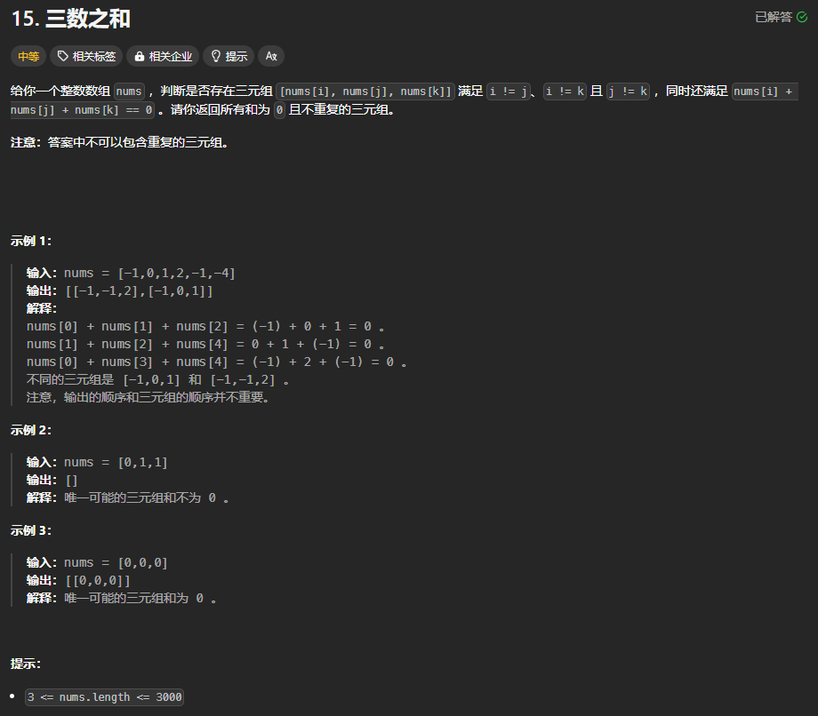

题目链接：[https://leetcode.cn/problems/3sum/description/](https://leetcode.cn/problems/3sum/description/)



## 题解
### 解题思路
将 3 个元素分为 1 个元素和 2 个元素，然后才来研究它们之间的关系。

枚举其中一个元素，然后再使用双指针来查找 2 数之和等于这个元素的相反数的 2 个元素。

题目要求三元组不重复，那么**如何去重？**

> 什么时候会出现重复？
>
> 当元素为 [-1, -1, 1, 1, 0, 0] 时，则会出现重复，原因是我们将多个相同的元素看做不同的元素，即使那个元素我们已经遍历过了。
>

所以，如果要去重的话，就要将多个相同的元素看做同一个元素。

我们知道，如果数组是有序的话，使用双指针只需要 O(n) 的时间就找到目标值。

对于此题来说，如果数组有序，还可以在遍历的同时就可以实现去重：

+ 数组有序时，相同的元素是紧挨在一起的
+ 如果遍历到某个元素，遍历的前一个元素和它是一样的，那么就说明这个元素其实已经遍历过了，就应该跳过此元素

但是这里，也有个特殊的情况，就是如果输入的数据就是 [0, 0, 0],此时，按照题目的意思并没有重复的元素，那么，这时候如何解释呢？

导致这种问题发生的原因是什么？

因为题目要求的是 3 元组，所以，就必须要有 3 个元素，即使它们是相同的也要看做不同的元素对待。这启发我们，用 3 个指针，如果当前元素和该指针的上一个元素相同才“跳过”，这就避免了上面这种情况，即随时都保证至少有 3 个元素在逻辑上是不同的。不能提前使用 dedup 函数来实现去重，因为这 3 个 0 会被当做一个元素而去除掉。

### 代码
```rust
impl Solution {
    pub fn three_sum(mut nums: Vec<i32>) -> Vec<Vec<i32>> {
        nums.sort();

        let n = nums.len();
        let mut ans = vec![];
        for i in 0..n - 2 {
            // i 指针的上一个元素是 i - 1
            if i > 0 && nums[i - 1] == nums[i] {
                continue;
            }

            // 枚举一个数，用双指针去找出 2 数之和等于这个数的相反数的 2 个数字
            let mut left = i + 1;
            let mut right = n - 1;
            while left < right {
                let tow_sum = nums[left] + nums[right];
                // left 加上 left..=right 之间的任何一个数都小于 target
                if tow_sum < -nums[i] {
                    // 这里不需要去重，因为如果上一个 left 不满足，那么现在这个 left 也不满足，算法还会执行这个 if 分支
                    left += 1;
                } else if tow_sum > -nums[i] {
                    // 同样的，这里也不要去重
                    right -= 1;
                } else {
                    ans.push(vec![nums[i], nums[left], nums[right]]);
                    // 在相等的情况时，必须执行去重的逻辑
                    left += 1;
                    while left < n && nums[left] == nums[left - 1] { left += 1; }
                    right -= 1;
                    // right 的上一个元素时 right + 1
                    while right > i && nums[right] == nums[right + 1] { right -= 1; }
                }
            }
        }

        ans
    }
}
```

****

