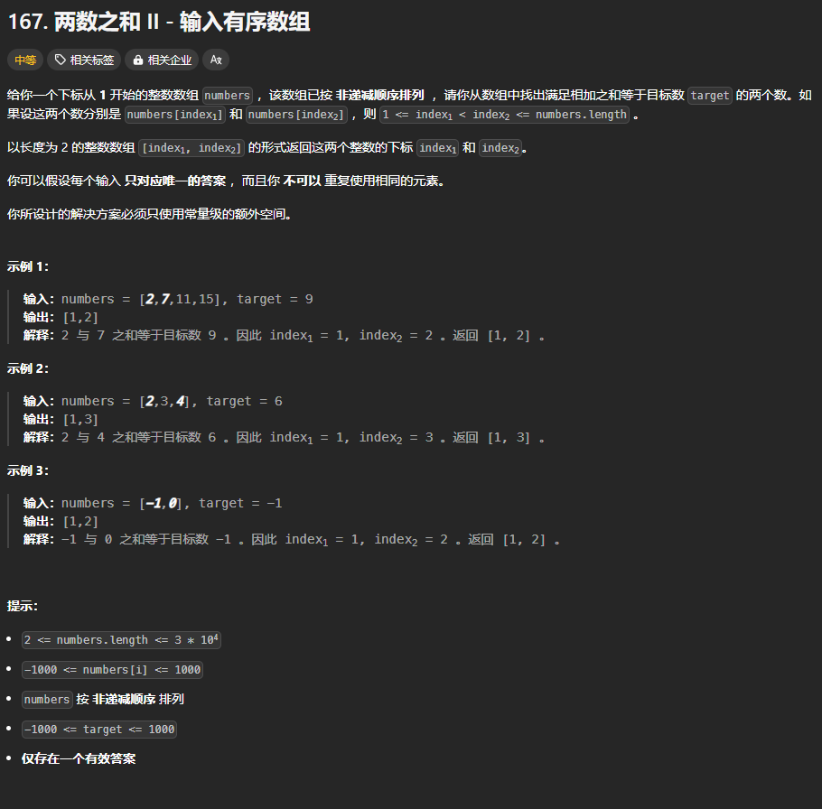

题目链接：[https://leetcode.cn/problems/two-sum-ii-input-array-is-sorted/](https://leetcode.cn/problems/two-sum-ii-input-array-is-sorted/)



## 题解
```rust
impl Solution {
    pub fn two_sum(numbers: Vec<i32>, target: i32) -> Vec<i32> {
        let n = numbers.len();
        let mut left = 0;
        let mut right = n - 1;

        while left < right {
            // 如果小于 target 则说明 left 和 numbers[left + 1..=right] 之间的任一元素的和都小于 target
            // 所以，更新 left
            if numbers[left] + numbers[right] < target {
                left += 1;
                // 如果大于 target，则说明 right 和 numbers[left..right] 之间的任一元素的和都大于 target
                // 所以，更新 right
            } else if numbers[left] + numbers[right] > target {
                right -= 1;
            } else {
                return vec![left as i32 + 1, right as i32 + 1];
            }
        }

        unreachable!()
    }
}
```

