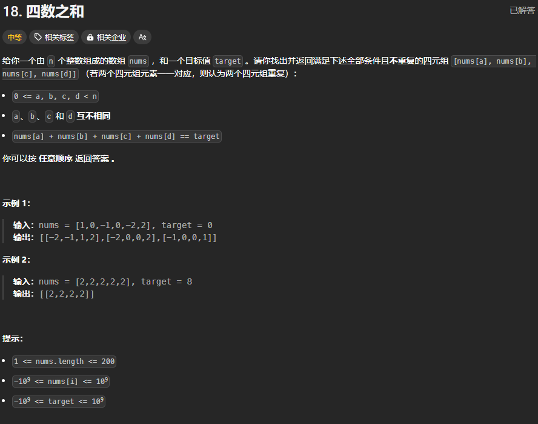

题目链接：[https://leetcode.cn/problems/4sum/description/](https://leetcode.cn/problems/4sum/description/)



## 思路
使用 2 个指针来枚举 2 个数，然后，在使用双指针来找到 4 数之和等于 target 的另外 2 个数。

去重的逻辑和 3 数之和一样。

可不可以使用 2 个双指针？

这样的话，这 2 个双指针寻找的目标值是多少呢？所以，只能先枚举 2 个数。

## 代码
```rust
impl Solution {
    pub fn four_sum(mut nums: Vec<i32>, target: i32) -> Vec<Vec<i32>> {
        nums.sort();
        let n = nums.len();
        let mut ans = vec![];
        if n < 4 {
            return ans;
        }

        // 先枚举 2 个数
        for i in 0..n - 3 {
            if i > 0 && nums[i] == nums[i - 1] {
                continue;
            }
            for j in i + 1..n - 2 {
                if j > i + 1 && nums[j] == nums[j - 1] {
                    continue;
                } 

                let mut left = j + 1;
                let mut right = n - 1;
                while left < right {
                    let two_sum = nums[left] as i64 + nums[right] as i64;
                    let target = target as i64 - (nums[i] + nums[j]) as i64;

                    if two_sum > target {
                        right -= 1;
                    } else if two_sum < target {
                        left += 1;
                    } else {
                        ans.push(vec![nums[i], nums[j], nums[left], nums[right]]);
                        left += 1;
                        while left < n && nums[left] == nums[left - 1] { left += 1; }
                        right -= 1;
                        while right > j && nums[right] == nums[right + 1] { right -= 1; }
                    }
                }
            }
        }

        ans
    }
}
```

注意，提供给出的数据范围有陷阱，可能会超过 i32 的表示范围，所以使用 i64。

上述代码没有考虑额外的优化措施：

+ 在 i 及其后的 3 个数之和已经大于 target 的情况下，可以跳出本层循环
+ 如果 i 加上数组最大的 3 个数之和小于 target，则可以 continue 循环
+ 同样，对变量 j 也上述 2 种优化

