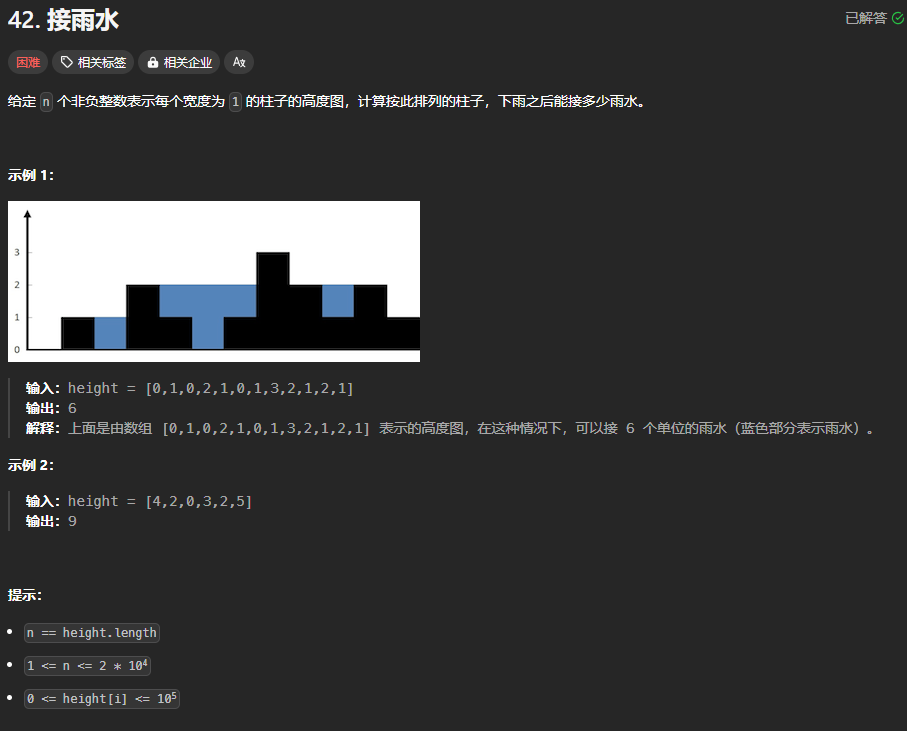
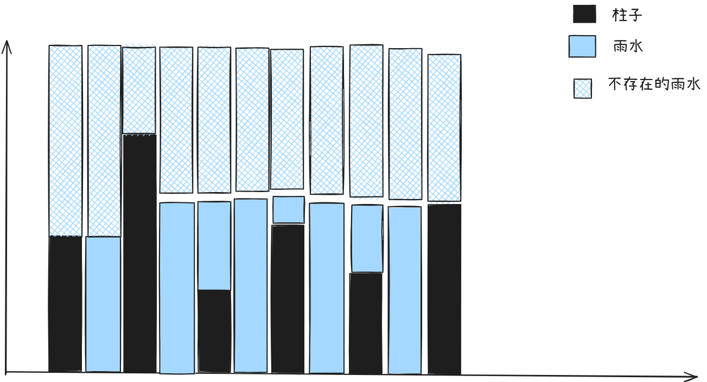
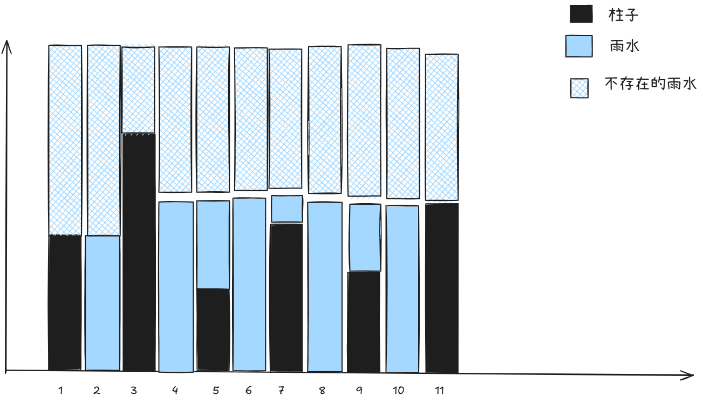

题目链接：[https://leetcode.cn/problems/trapping-rain-water/description/](https://leetcode.cn/problems/trapping-rain-water/description/)



## 思路


我们如上图一样，分开看每一个柱子，每一根柱子由 2 部分组成：

1. 柱子本身
2. 雨水

我们主要的目的是计算雨水区域的面积。

我们通过观察上图发现：**一个柱子是否能存住水，是看其两侧是否还有比其高的柱子**，如果两侧都有比起高的柱子，如果有的话，假设这两根柱子的高度为 a, b，当前的这条柱子为 c。那么，有 `a, b > c`，此时，此柱子能存储的水为 `1x(min(a, b)) - c`。

现在的话，问题就很简单了，只要能够快速地确定此柱子的左边的最大高度和右边的柱子最大高度就可以计算出来它能装多少水。

确定柱子的左边和右边柱子的最大高度有 2 中思路：

### 思路一
从前至后和从后至前，分别用一个数组来存储在遍历过程中所遇到的最大值。

#### 代码
```rust
impl Solution {
    pub fn trap(height: Vec<i32>) -> i32 {
        let n = height.len();

        // 前缀最大值
        let mut pre_max = vec![0; n];
        pre_max[0] = height[0];
        // 后缀最大值
        let mut suf_max = vec![0; n];
        suf_max[n - 1] = height[n - 1];

        for i in 1..n {
            pre_max[i] = height[i].max(pre_max[i - 1]);
        }
        for i in (0..n - 1).rev() {
            suf_max[i] = height[i].max(suf_max[i + 1]);
        }

        let mut ans = 0;
        // 开始计算雨水的面积
        // 最开始和最末尾的那两根柱子是不可能有雨水的
        for i in 1..n - 1 {    
            if pre_max[i - 1] > height[i] && suf_max[i + 1] > height[i] {
                // 能存储一定量的雨水
                ans += pre_max[i - 1].min(suf_max[i + 1]) - height[i];
            }
        }

        ans
    }
}
```

上述计算雨水面积的代码可以优化：

1. 由于 `prev_max[i]` 一定大于等于 `height[i]`，所以，如果只要寻找比它大的值的话（例如地 23）行是可以这样写的:`pre_max[i] > height[i]`，同样的思路，此优化也可以应用于 `suf_max`
2. 更近一步，由于和上一优化同样的原因，`pre_max[i].min(suf_max[i])` 的最小值就是 `height[i]`，所以可以安全地减去 `height[i]` 而不担心溢出，所以，可以直接去掉 `if` 语句
3. 由于上述 2 步优化，`pre_max`、`height` 和 `suf_max` 都是使用 i 来索引的，而且它们之间的长度是相同的，所以，可以直接使用 `iter` 的 `zip` 来实现

#### 优化后的代码
```rust
impl Solution {
    pub fn trap(height: Vec<i32>) -> i32 {
        let n = height.len();

        // 前缀最大值
        let mut pre_max = vec![0; n];
        pre_max[0] = height[0];
        // 后缀最大值
        let mut suf_max = vec![0; n];
        suf_max[n - 1] = height[n - 1];

        for i in 1..n {
            pre_max[i] = height[i].max(pre_max[i - 1]);
        }
        for i in (0..n - 1).rev() {
            suf_max[i] = height[i].max(suf_max[i + 1]);
        }

        let mut ans = 0;
        // 开始计算雨水的面积
        for ((height, prev_max), suf_max) in height.into_iter().zip(pre_max).zip(suf_max) {
            ans += prev_max.min(suf_max) - height;
        }

        ans
    }
}
```

### 思路二
这是以思路一为基础的改进。

```rust
// 开始计算雨水的面积
for ((height, prev_max), suf_max) in height.into_iter().zip(pre_max).zip(suf_max) {
    ans += prev_max.min(suf_max) - height;
}
```

思路一计算 ans 的时候，只需要 prev_max 和 suf_max 之间的最小值就可以了，那么，思路二所做的事情就是在计算 ans 的同时计算出 prev_max 和 suf_max.



还是拆分成每个柱子来看，用 2 个指针指向数组的两端，不同的是，这次不提前计算 pre_max 和 suf_max，而是和计算雨水面积一起放在同一个循环中计算。

假设 left 指向 2，right 指向 10。

然后，开始计算 left 能够容纳的雨水，由于 left 左边的柱子的高度最大值（pre_max = height[1]）小于 right 右边的柱子高度的最大值（suf_max = height[11]），prev_max.min(suf_max) 是确定的。同时，对于 right 来说，由于现在还没有在左边发现比它高的柱子，此时，它的 prev_max 是不确定的，所以还不能移动 right。

#### 代码
```rust
impl Solution {
    pub fn trap(height: Vec<i32>) -> i32 {
        let n = height.len();
        let mut pre_max = 0;
        let mut suf_max = 0;
        let mut ans = 0;

        let mut left = 0;
        let mut right = n - 1;
        // 这里是小于等于，不是小于，因为当它们相等的时候，计算的也是一个柱子存储水的容量，是有意义的
        while left <= right {
            pre_max = pre_max.max(height[left]);
            suf_max = suf_max.max(height[right]);

            if pre_max < suf_max {
                // left 的右边的最大值可以确定了，进而最小值就可以确定了
                ans += pre_max - height[left];
                left += 1;
            } else {
                ans += suf_max - height[right];
                // 这里，如果直接写 right -= 1 的话可能会导致溢出，而且溢出了变为最大值，进而，导致数组越界
                if right == 0 { break; } else { right -= 1; }
            }
        }

        ans
    }
}
```

## 核心思路
1. **将问题拆分来看**：将总的雨水的面积拆分为一个柱子一个柱子来看
2. 通过观察，找到每个柱子计算雨水面积的思路
3. 通过对计算雨水面积所需要的数据进行分析，看是否可以优化


