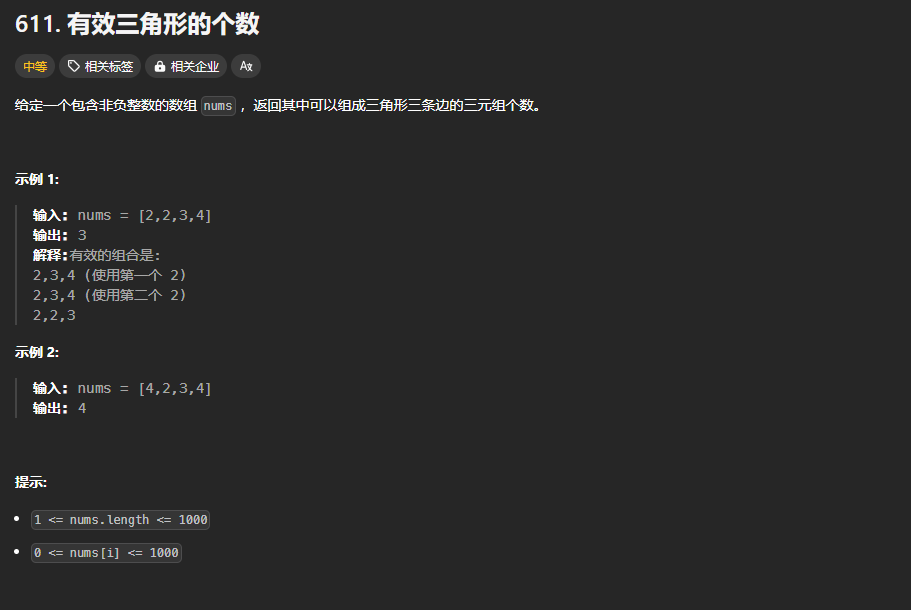

题目链接：[https://leetcode.cn/problems/valid-triangle-number/](https://leetcode.cn/problems/valid-triangle-number/)



## 思路
3 条边可以构成一个三角形的条件是（满足其一即可）：

+ 任一两边这和大于第三边
+ 任一两边之差小于第三边

这里选用第一个条件，即任一两边这和大于第三边就可以构成一个三角形。

这里说的任意 2 边对我们来说，编码太麻烦，所以，事先给数组排一个序的话，我们就不用“任意”选择两边了：只要满足最小的 2 边加起来大于第 3 边，则就可以构成一个三角形。

所以，我们的思路就是：

1. 枚举第 3 边，而且这个第 3 边从最大的数开始倒着枚举
2. 使用双指针来寻找另外 2 边

## 代码
```rust
impl Solution {
    pub fn triangle_number(mut nums: Vec<i32>) -> i32 {
        nums.sort();

        let mut ans = 0;
        let n = nums.len();
        // 倒着枚举第三边
        for i in (2..n).rev() {
            // 使用双指针来寻找另外两边
            let mut left = 0;
            let mut right = i - 1;
            while left < right {
                if nums[left] + nums[right] > nums[i] {
                    // 如果 left + right > i,则说明 left 加上 left + 1..=right 之间的任一一个数都大于 i
                    // 此时，需要移动 right，而移动 right 使 right 变小了，故而此时需要一个更大的 left，
                    // 但是，这里不移动 left，因为如果 right 不变（数组中具有重复的元素），移动 left 的话，
                    // 就会导致在下一次循环中，丧失进入此分支的机会
                    ans += (right - left) as i32;
                    right -= 1;
                } else {
                    // 如果等于的话，移动 left 还是 right 呢？
                    //    应该移动 left，因为移动 right 只会导致和越来越小，后面的 2 边之和不会大于第三边
                    left += 1;
                }
            }
        }

        ans
    }
}
```


