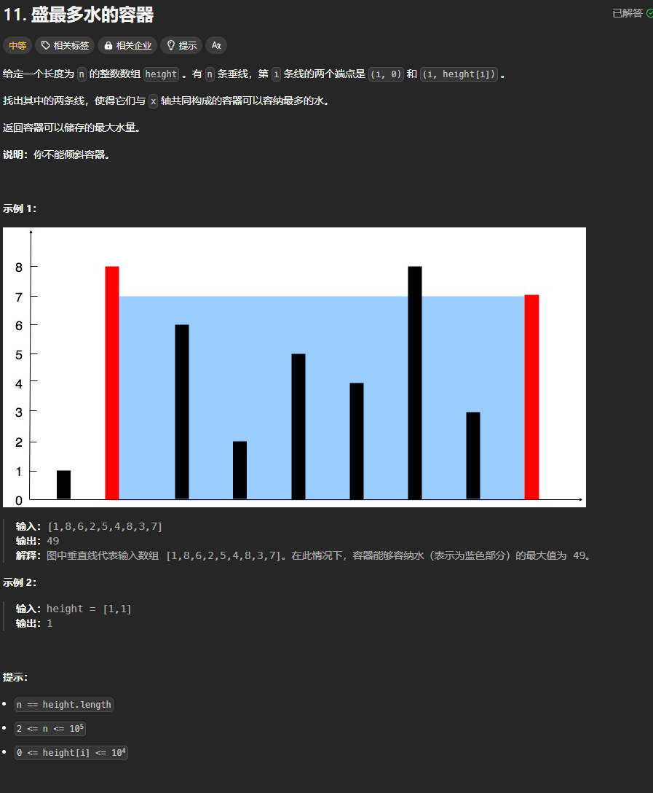

题目链接：[https://leetcode.cn/problems/container-with-most-water/description/](https://leetcode.cn/problems/container-with-most-water/description/)



## 思路
使用双指针充当容器的 2 个侧壁，最开始的时候，让容器的宽度最宽，即双指针位于数组的最左端和最右端。

现在的目的是最大化容器的容积。

如果最开始的时候容积不是最大的，那么只有在数组的中间找到一个更高的容器壁才能使容器的容积增大。

那么，就让当前最小的那个容器壁移动到更高的容器壁，以实现更大的容积。很明显，不能移动更高的那一壁。

如果当前两个容器壁相等，则移动任一一个都是可以的。

## 代码
```rust
impl Solution {
    pub fn max_area(height: Vec<i32>) -> i32 {
        let n = height.len();

        let mut left = 0;
        let mut right = n - 1;
        let mut ans = 0;

        while left < right {
            ans = ans.max((right - left) as i32 * height[left].min(height[right]));

            if height[left] < height[right] {
                // 移动 left 去找到更高的容器壁
                left += 1;
                while left < right && height[left] <= height[left - 1] { left += 1; }
            } else {
                // 相等的时候也移动 right
                right -= 1;
                while right > left && height[right] <= height[right + 1] { right -= 1; }
            }
        }

        ans
    }
}
```

