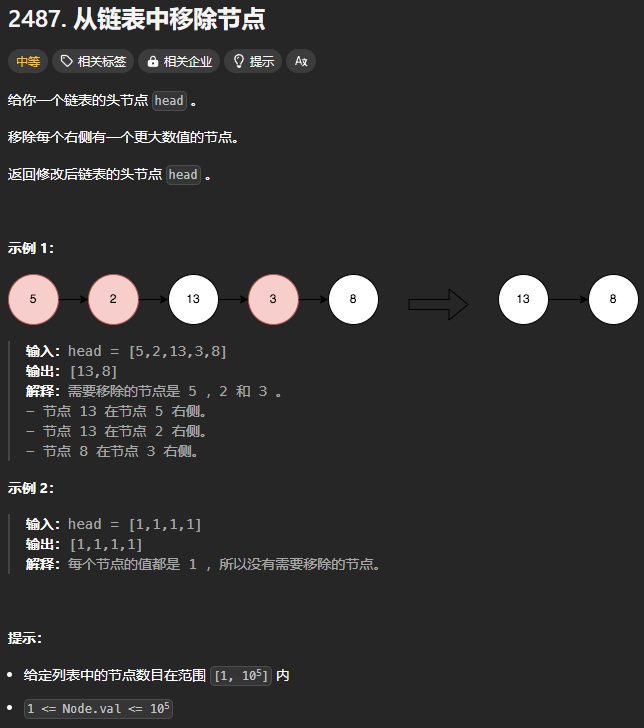
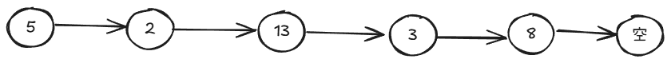
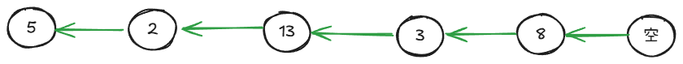

题目链接：[https://leetcode.cn/problems/remove-nodes-from-linked-list/description/](https://leetcode.cn/problems/remove-nodes-from-linked-list/description/)



## 思路一
题目的意思相当于是让链表递减排序。

如果我们想要直观地完成，我们需要能够**删除上一个节点**，而且是能不断地删除上一个节点。

例如，我们我们遍历到 13 的时候，就要不断删除 2、5。所以，我们必须知道当前节点的上一个节点。我们可以用一个额外的栈来保存，这很符合我们的需要。


由于我们可能需要删除头节点，所以，我们需要使用虚拟头结点。

由于虚拟头节点要在栈中保持为第一个元素，所以，我们需要赋给虚拟头节点很大的值。

### 代码
```go
func removeNodes(head *ListNode) *ListNode {
    max := 100001
    dummy := ListNode { Val: max, Next: head }
    previousNodes := []*ListNode{ &dummy }

    cur := head
    for cur != nil {
        for cur.Val > previousNodes[len(previousNodes) - 1].Val {
            // 此时，需要移除上一个节点
            previousNodes[len(previousNodes) - 2].Next = cur
            // 从栈中移除上一个元素的引用
            previousNodes = previousNodes[: len(previousNodes) - 1]
        }
        previousNodes = append(previousNodes, cur)
        cur = cur.Next
    }

    return dummy.Next
}
```

内层循环最多会循环 n 次，所以，时间复杂度是 的，空间复杂度是 的。

## 思路二
使用递归。

如果我们按照如下的顺序调用递归函数：



则我们可以按照如下的顺序处理节点：



注意，只是按照上面的顺序处理节点，没有改变节点之间的引用关系。

这就相当于倒着遍历了。

我们只需要保留比当前节点更大的节点，我们就能完成此题。例如，我们遍历到 3 的时候，由于其比 8 小，我们就需要舍弃 3 而返回 8.

### 代码
```go
func removeNodes(head *ListNode) *ListNode {
    // 此处避免了返回 nil
    if head.Next == nil {
        return head
    }

    // 此递归函数返回倒着遍历所遇到的最大节点
    maxNode := removeNodes(head.Next)
    if maxNode.Val > head.Val {
        // 返回最大的节点
        return maxNode
    }

    // 此时，head 的值大于等于 maxNode 的值
    head.Next = maxNode
    return head
}
```

时间复杂度：空间复杂度：

尽管这个思路的时间复杂度小于思路一，但是实际运行时间却比思路一要长。

## 思路三
反转原链表，然后倒着遍历。倒着遍历的时候，如果遇到下一个元素的值小于当前节点的值，则移除该节点。

然后，最终，再将遍历后的链表反转为正常的顺序。

### 代码
```go
func removeNodes(head *ListNode) *ListNode {
    reverseList := func (head *ListNode) *ListNode {
        var prev, cur *ListNode = nil, head
        for cur != nil {
            next := cur.Next
            cur.Next = prev
            prev = cur
            cur = next
        }
        return prev
    }

    reversedList := reverseList(head)
    cur := reversedList
    for cur != nil && cur.Next != nil {
        for cur.Next != nil && cur.Next.Val < cur.Val {
            cur.Next = cur.Next.Next
        }
        cur = cur.Next
    }

    return reverseList(reversedList)
}
```

时间复杂度：空间复杂度：

这个思路运行效率最高。

