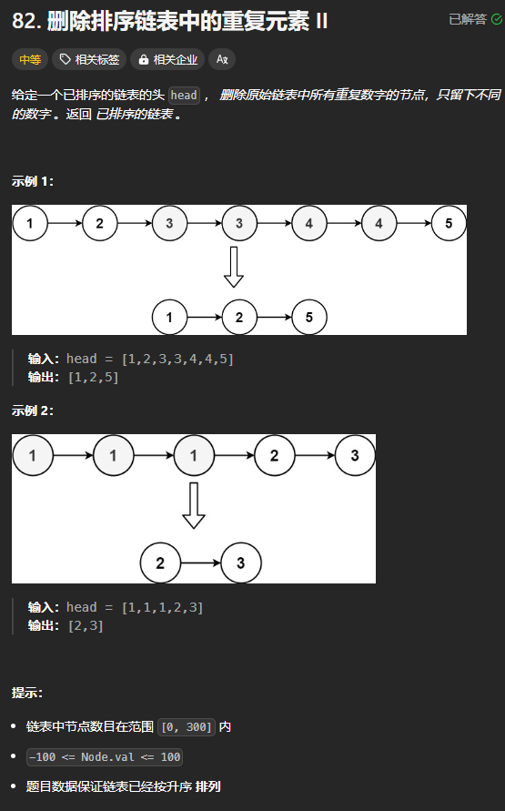
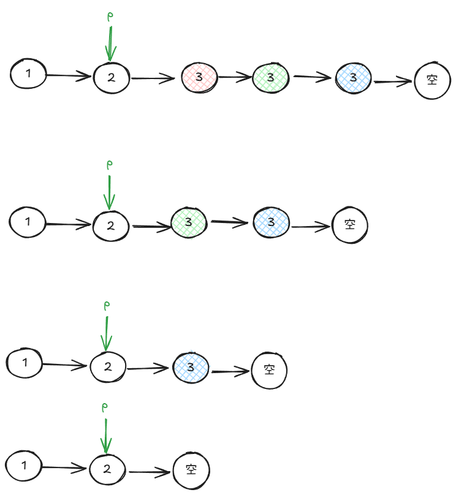

题目链接:[https://leetcode.cn/problems/remove-duplicates-from-sorted-list-ii/](https://leetcode.cn/problems/remove-duplicates-from-sorted-list-ii/)



## 思路
由于此题可能删除头节点，故而使用虚拟头结点。

删除链表的核心思路是要知道被删除节点的前一个节点。

例如：


如果要删除 3，我们要有个指针指向 2。我们将这个指针定义为 p。所以，当 p.next.val == p.next.val.val 的时候，我们就知道有重复元素。

我们将重复的元素的值记录下来，这样当 p.next.val 为重复的值的时候，就删除，从而达到只保留下无重复元素的目的：



## 代码
```go
func deleteDuplicates(head *ListNode) *ListNode {
    dummy := ListNode { Next: head }

    p := &dummy
    // p 的后面至少有 2 个元素的时候，继续循环
    for p.Next != nil && p.Next.Next != nil {
        // 有重复元素
        if p.Next.Val == p.Next.Next.Val {
            val := p.Next.Val
            for p.Next != nil &&  p.Next.Val == val {
                // 删除 p.Next
                p.Next = p.Next.Next
            }
        } else {
            p = p.Next
        }
    }
    return dummy.Next
}
```

