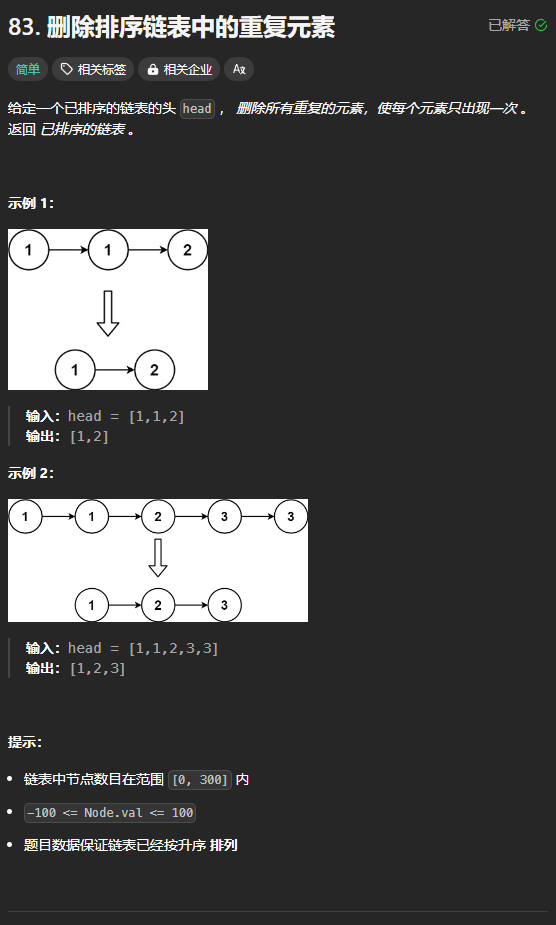

题目链接：[https://leetcode.cn/problems/remove-duplicates-from-sorted-list/description/](https://leetcode.cn/problems/remove-duplicates-from-sorted-list/description/)



## 思路
使用一个指针 cur 来指向一个值的第一个元素，然后不断遍历它的下一个节点，直到它的下一个节点的值与其不同。如果途中遇到了和其值一样的节点，就删除该节点。

## 代码
```go
func deleteDuplicates(head *ListNode) *ListNode {
    cur := head
    for cur != nil {
        for cur.Next != nil && cur.Next.Val == cur.Val {
            // 删除 cur.Next
            cur.Next = cur.Next.Next
        }
        cur = cur.Next
    }

    return head
}
```

