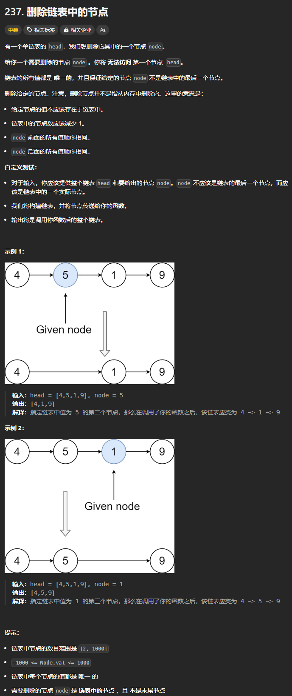

题目链接：[https://leetcode.cn/problems/delete-node-in-a-linked-list/description/](https://leetcode.cn/problems/delete-node-in-a-linked-list/description/)



## 思路
题目的意思是说，在无法知道被删除节点的前一个节点的情况下，如何删除给定的节点？

这是一个脑筋急转弯：可以将下一个节点的值拷贝到待删除的节点中，然后将下一个节点删除。这样操作的结果就相当于删除了本节点。

## 代码
```go
func deleteNode(node *ListNode) {
    node.Val = node.Next.Val
    node.Next = node.Next.Next
}
```

