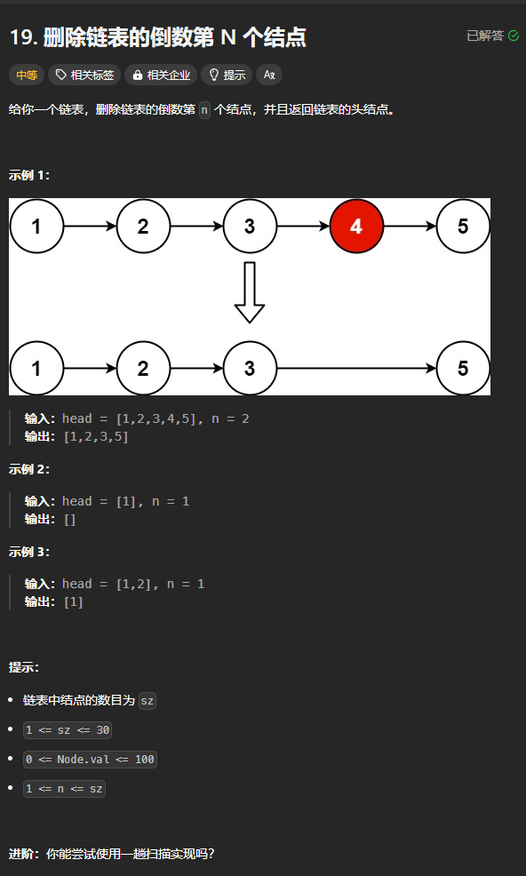
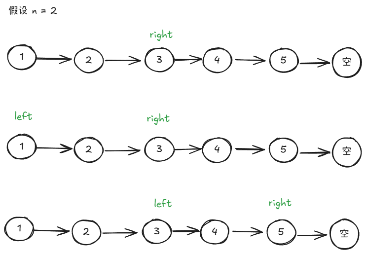

题目链接：[https://leetcode.cn/problems/remove-nth-node-from-end-of-list/description/](https://leetcode.cn/problems/remove-nth-node-from-end-of-list/description/)



## 思路
首先，让一个指针 right 先走 n 步，走了 n 步之后再用一个指针 left 从 head 处同时与 right 一起走，直到 right.next 为空:



这样能保证 right 和 left 之间的相对距离一定是 n，这样的话，当 right.next 为空的时候，我们就知道了倒数的第 n + 1 个节点了（即 left 所指的节点）。

这里为了处理 n 等于链表的长度的情况，使用一个虚拟头节点来指向 head。

添加了虚拟头节点之后，left 和 right 从 dummy 出发和原来从 dummy 出发的效果是一样的，因为其相对距离都是 n。

## 代码
```go
func removeNthFromEnd(head *ListNode, n int) *ListNode {
    dummy := ListNode { Next: head }

    // 先让 right 走 n 步
    right := &dummy
    for cnt := 0; cnt < n; cnt++ {
        right = right.Next
    }

    // 让 left 和 right 一起走
    left := &dummy
    for right.Next != nil {
        left = left.Next
        right = right.Next
    }

    // 删除 left 的下一个节点
    left.Next = left.Next.Next

    return dummy.Next
}
```

