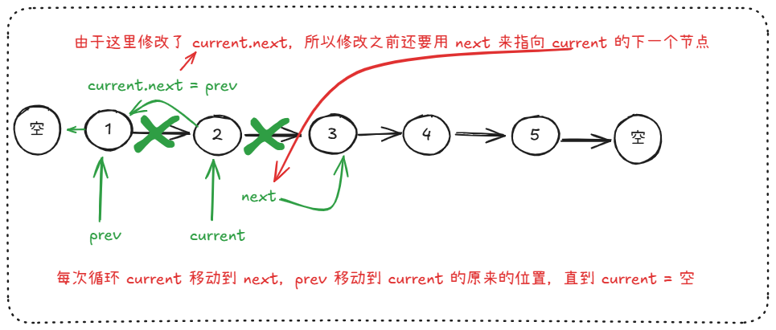
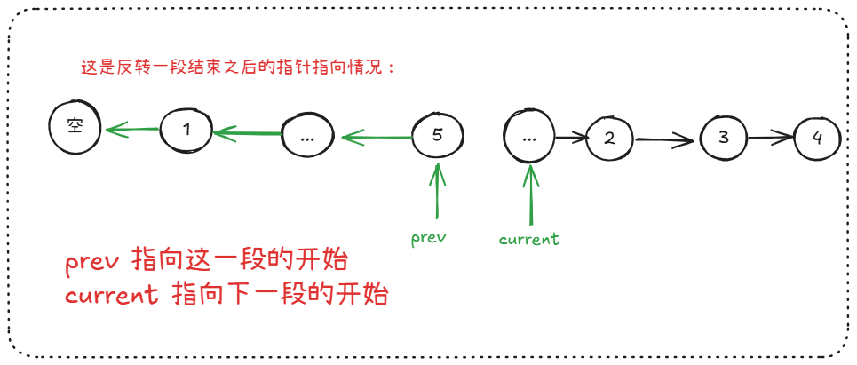

反转链表的相关算法是指针的艺术。

最简单的反转链表就是使用两个指针，一个指向当前的值 current，一个指向前面的值 prev，我们所需要做的就是 current.next = prev。而这里由于更改了 current.next，所以需要使用 next 来事先保存 current.next:

由于有些更“高级”的反转链表需要一段一段地反转，所以，当反转一段结束之后，我们知道当前这一段的开始和下一段的开始是很有必要的：

有时候我们为了避免对头结点进行特殊的处理，我们通常会加入一个**虚拟头节点（dummy head）**来指向真正的 head 节点，从而避免处理当前操作的节点是头结点的情况。

头节点要单独处理是因为头结点的前面没有节点，这会造成算法的运行失败，而我们不想处理这种特殊情况。

