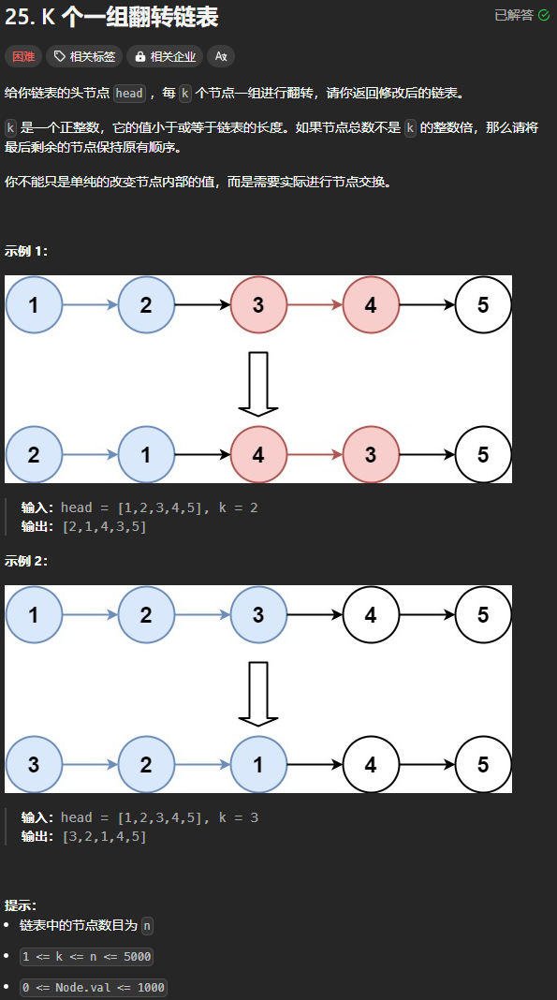
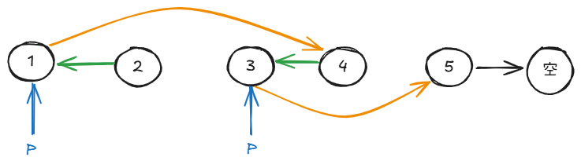
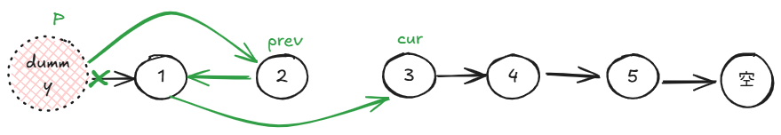
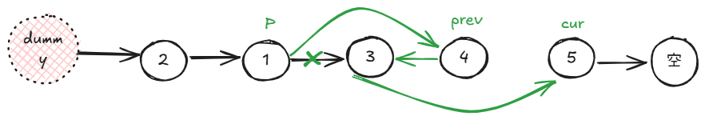

题目链接：[https://leetcode.cn/problems/reverse-nodes-in-k-group/](https://leetcode.cn/problems/reverse-nodes-in-k-group/)



## 思路一


主要的思路如上图。

其中 P 的含义是：上一段的末尾节点。

还有一点，我们要事先就找到要返回的 head，在这里是 2.

仔细看，第一个 P 要指向下一段反转链表完成之后的 prev，而我们还不得不更新 P，所以，我们要保存上一个 P

### 代码
```go
func reverseKGroup(head *ListNode, k int) *ListNode {
    // 从 head 开始，计算链表的长度
    lengthGeK := func (head *ListNode) bool {
        cnt := 0
        for ; head != nil && cnt < k; cnt++ {
            head = head.Next
        }

        return cnt >= k
    }

    // 寻找要返回的头节点
    newHead := head
    if lengthGeK(head) {
        for cnt := 1; cnt < k; cnt++ {
            newHead = newHead.Next
        }
    }

    current := head
    var prev *ListNode = nil
    var prevP *ListNode = nil
    for lengthGeK(current) {
        p := current

        // 反转 k 个节点
        for cnt := 0; cnt < k; cnt++ {
            next := current.Next
            current.Next = prev
            prev = current
            current = next
        }

        // 反转结束后，current 位于下一段的开始，prev 位于这一段的末尾（开始）
        p.Next = current
        if prevP != nil {
            prevP.Next = prev
        }

        prevP = p
    }

    return newHead
}
```

## 思路二
我们还可以使用虚拟头节点:



翻转下一段：



从中我们可以看到，涉及到 3 个指针，原来的写法也需要三个指针。但是这种思路引入虚拟头节点之后，代码变得更简洁了，而且思路更加清晰了。

而且，我们可以看到指针 P 的更新其实就是更新为 P.next。

### 代码
```go
func reverseKGroup(head *ListNode, k int) *ListNode {
    // 添加虚拟头节点
    dummy := &ListNode { Next: head }

    // 计算出链表的长度
    n := 0
    for cur := head; cur != nil; cur = cur.Next { n++ }

    p := dummy
    var cur, prev *ListNode = dummy.Next, nil
    for ; n >= k; n -= k {
        // 反转 k 个节点
        for cnt := 0; cnt < k; cnt++ {
            next := cur.Next
            cur.Next = prev
            prev = cur
            cur = next
        }

        pNext := p.Next
        p.Next.Next = cur
        p.Next = prev
        p = pNext
    }

    return dummy.Next
}
```

