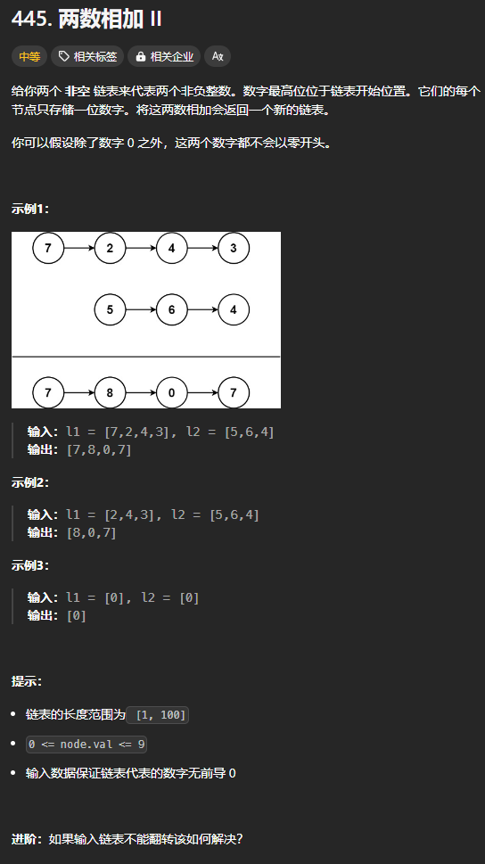

题目链接：[https://leetcode.cn/problems/add-two-numbers-ii/description/](https://leetcode.cn/problems/add-two-numbers-ii/description/)



## 思路
首先，将输入的两个链表翻转，我们要从个位数开始计算 2 数之和。

然后根据相加的结果，构造出一个链表。

如果不翻转链表的话，就使用两个FIFO 栈来顺序保存遍历两个链表得到的结果。

## 代码
```go
func addTwoNumbers(l1 *ListNode, l2 *ListNode) *ListNode {
    reverseList := func (head *ListNode) *ListNode {
        var prev, cur *ListNode = nil, head
        for cur != nil {
            next := cur.Next
            cur.Next = prev
            prev = cur
            cur = next
        }
        return prev
    }

    a := reverseList(l1)
    b := reverseList(l2)

    carry := 0
    var prev *ListNode = nil
    for a != nil || b != nil || carry != 0 {
        sum := carry
        if a != nil {
            sum += a.Val
            a = a.Next
        }
        if b != nil {
            sum += b.Val
            b = b.Next
        }
        
        if sum >= 10 { 
            carry = 1
            sum -= 10 
        } else { 
            carry = 0 
        }

        cur := ListNode { Val: sum, Next: prev }
        prev = &cur
    }
    return prev
}
```

