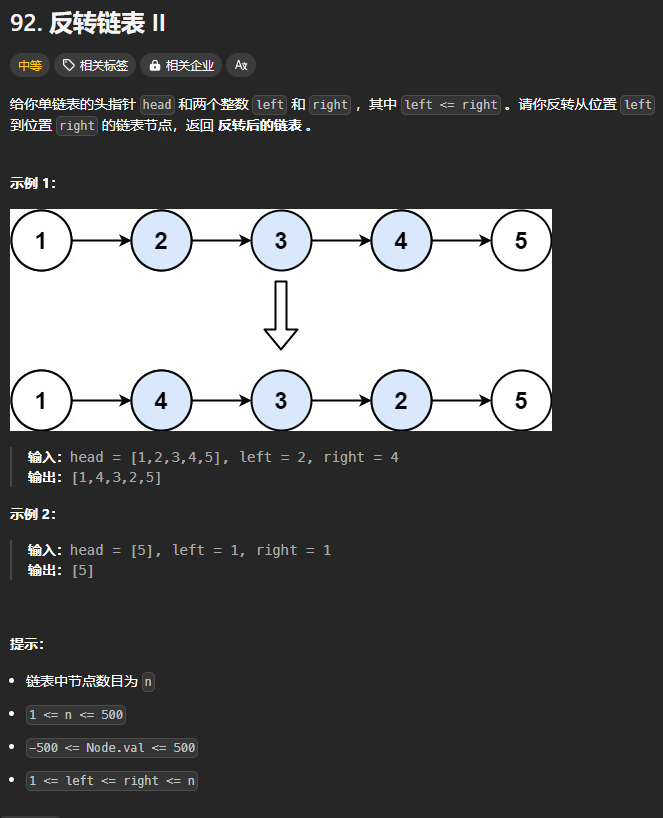
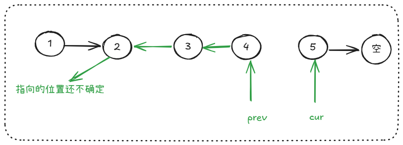
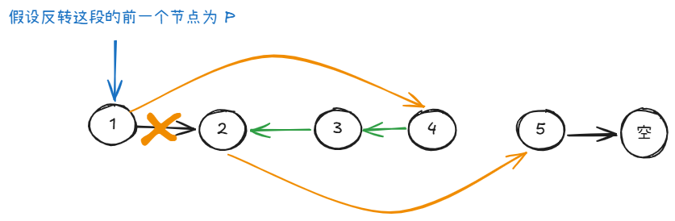
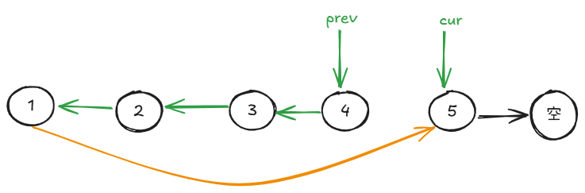
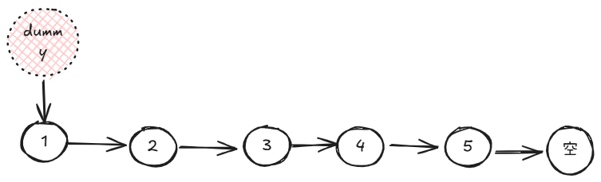
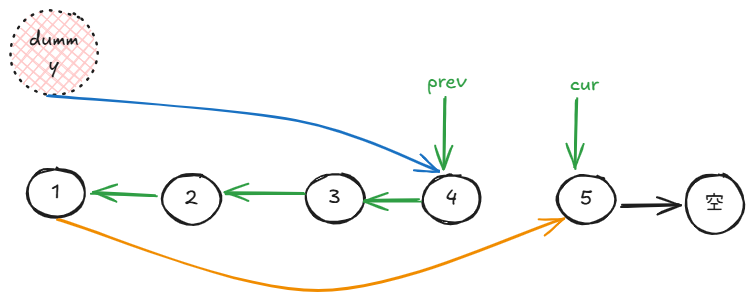

题目链接：[https://leetcode.cn/problems/reverse-linked-list-ii/description/](https://leetcode.cn/problems/reverse-linked-list-ii/description/)



## 思路
当我们只反转某一段时，我们反转结束之后，有下面这种情况：



然后，我们需要将 2 的 next 指针指向 cur 所指的位置，将这一段的上一个节点（假设为 P 节点） 1 的 next 指针指向 prev 指向的位置：



由于上述操作中，我们需要操作 P 节点，那么，如果没有该节点呢？假如需要反转的是 1 ~ 4 呢？



此时，将没有节点来更新 next 来指向 prev。对于这种情况，我们需要添加一个虚拟头节点来指向原来的头节点:



然后，反转结束之后，由于 dummy 节点是反转的这一段的上一个节点，我们就可以执行如下的操作：



返回的时候，返回 dummy.next 就可以了。

这样的话，我们就需要对所有的链表都添加虚拟头结点。

## 代码
对于 Rust 菜鸡来说，Go 写链表舒服多了，有时间再琢磨一下 Rust 怎么写（TODO）：

```go
func reverseBetween(head *ListNode, left int, right int) *ListNode {
    dummy := ListNode { Val: 0, Next: head }

    // 确定 p 的位置
    cnt := 1
    p := &dummy
    for ; cnt < left; cnt++ { p = p.Next }

    // 开始反转链表
    cur := p.Next
    // prev 先初始化为 nil
    var prev *ListNode = nil
    for ; cnt <= right; cnt++ {
        next := cur.Next
        cur.Next = prev
        prev = cur
        cur = next
    }

    p.Next.Next = cur
    p.Next = prev

    return dummy.Next
}
```


