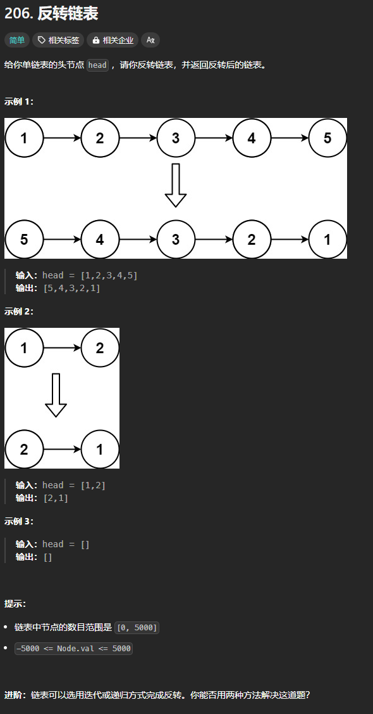

题目链接：[https://leetcode.cn/problems/reverse-linked-list/](https://leetcode.cn/problems/reverse-linked-list/)



## 思路
使用《概述》中描述的算法足够了。

## 代码
```rust
// #![allow(unused)]

// #[derive(PartialEq, Eq, Clone, Debug)]
// pub struct ListNode {
//     pub val: i32,
//     pub next: Option<Box<ListNode>>,
// }

// impl ListNode {
//     #[inline]
//     fn new(val: i32) -> Self {
//         ListNode { next: None, val }
//     }
// }
impl Solution {
    pub fn reverse_list(head: Option<Box<ListNode>>) -> Option<Box<ListNode>> {
        let mut prev = None;
        let mut current = head;
        while let Some(mut cur) = current {
            let next = cur.next;
            cur.next = prev;
            prev = Some(cur);
            current = next;
        }

        prev
    }
}
```


