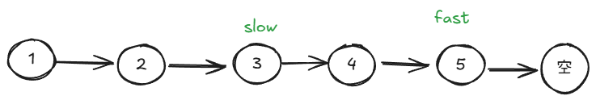
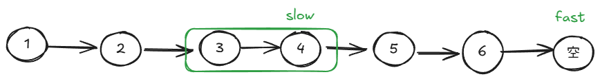
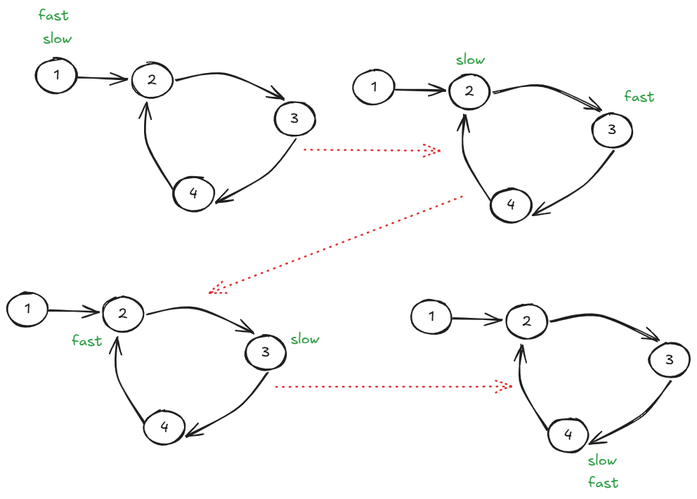
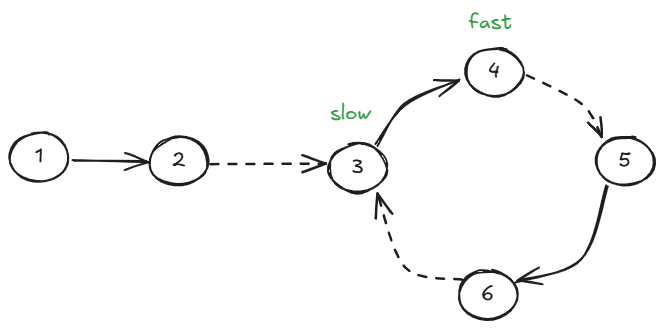
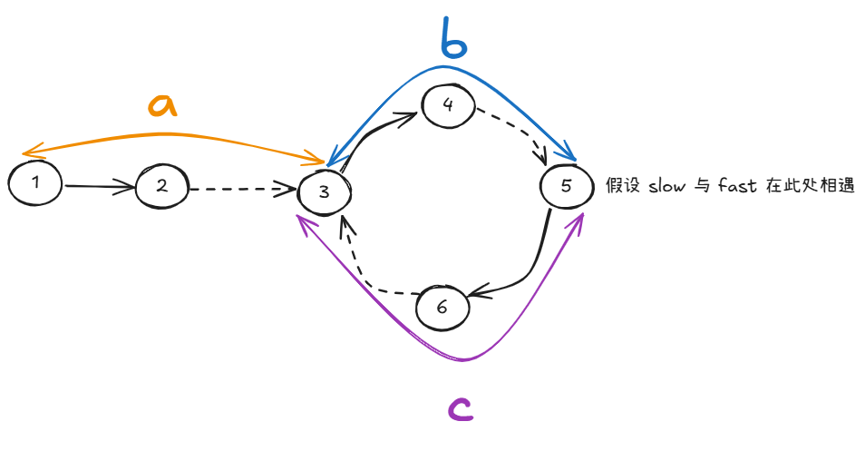
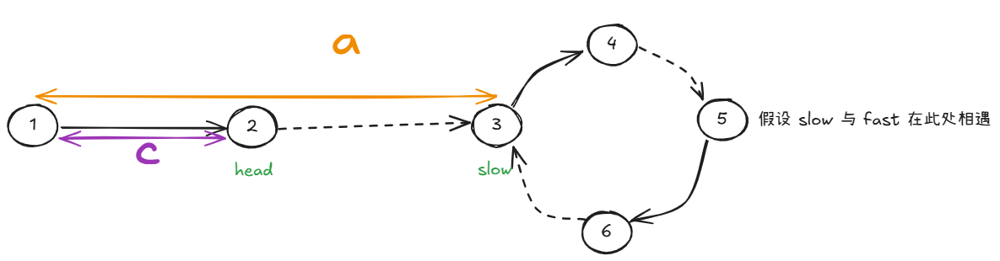

快慢指针是指，有 2 个指针，一个指针（fast 指针）走 2 步的同时，另一个指针（slow 指针）走 1 一步。

快慢指针的用武之地主要有 2 个：

+ 用于寻找数组、链表的中间节点
+ 用于确定链表是否有环

## 确定中间节点
此处所指的中间节点是指：

+ 如果数组或者链表的长度是奇数，则就是最中间的那一个元素，且 fast.next 为空

+ 如果数组或者链表的长度是偶数，则是中间两个数的后面一个，且 fast 为空

## 确定链表是否有环
由于快指针相对于慢指针每次多走一步，那么，如果链表有环的话，快指针一定能与慢指针相遇：

而且我们断言，**当 fast 与 slow 相遇的时候，slow 一定还没有在环中走完一圈**。

证明：

假设一种最坏的情况，slow 刚进入环的时候，fast 已经走完 n 圈，并刚好走到了 slow 的前面：

假设环长为 n，根据相对速度，fast 在走 n - 1 **次**就可以和 slow 相遇，那么很明显，当 fast 走了  n - 1 次的时候，slow 最多走了 n - 1 步，小于环长。故而 slow 一定还没有在环中走完一圈。

### 确定环的入口点
假设：

+ `a` 为链表头节点至环的入口点的长度
+ `b` 为环的入口至相遇点的长度
+ `c` 为相遇点至入口点的长度

则 slow 走过了 `a + b` 长度的链表， fast 走过了 `a + k(b + c) + b`，其中 `k` 表示 fast 在与 slow 相遇之前走了 k 圈环。

然后根据快指针移动的长度是慢指针的 2 倍，有：

，右边提取出来一个 (b + c)，得

，化简得

上式意味着：`a - c` 一定是环长的倍数。

这有什么用呢？

如果 fast 和 slow 相遇之后，我们让 head 走 c 步，同时也让 slow 走 c 步，则有：

然后，由于上述图中 2 ~ 3 的长度是环长的倍数，则如果此时按照这个位置继续往前走的话（head 和 slow 每次都只走一步），两者就会在入口点相遇。换句话说。**两者相遇的地方就是环的入口点**。

