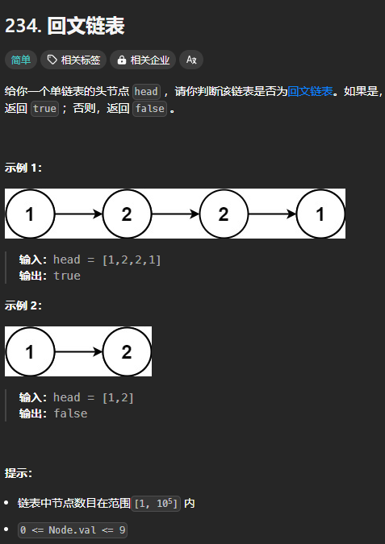

题目链接：[https://leetcode.cn/problems/palindrome-linked-list/description/](https://leetcode.cn/problems/palindrome-linked-list/description/)



## 思路
使用 O(1) 空间复杂度解决此题。

首先，反转链表的前半段，然后，同时从中间遍历前半段和后半段，这样的话，就能确定链表是否是回文的。

## 代码
```go
func isPalindrome(head *ListNode) bool {
    slow, fast := head, head
    var prev *ListNode = nil

    for fast != nil && fast.Next != nil {
        fast = fast.Next.Next

        // 反转链表的前半段
        slowNext := slow.Next
        slow.Next = prev
        prev = slow
        slow = slowNext
    }

    // slow 就是链表的中间节点，也是后半段的开始
    // prev 就是翻转后的前半段的头结点
    a, b := prev, slow

    // 这里还有很重要的一点，如果链表的数量为奇数，则 b 链表会比 a 链表多一个节点
    // 就是现在 b 所指的那个节点，去除那个节点是没有问题的，不会影响结果
    if fast != nil {
        // 当链表的数量为奇数的时候，fast 不为空
        b = b.Next
    }

    for a != nil && b != nil {
        if a.Val != b.Val {
            return false
        }
        a = a.Next
        b = b.Next
    }
    
    return true
}
```

